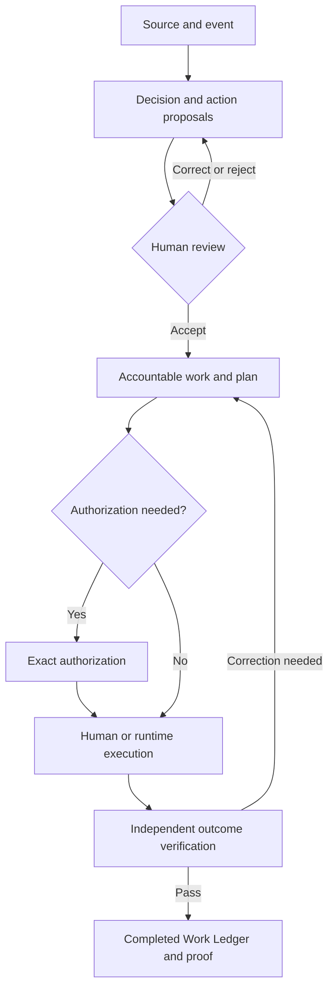

# Goal — Genius Workforce OS

> Source: [https://geniusaidubai.atlassian.net/wiki/spaces/G/pages/21397571](https://geniusaidubai.atlassian.net/wiki/spaces/G/pages/21397571)  
> Confluence page id `21397571` (exported for Genius AI hiring take-home).

---

## Unified product scope and development guide

**Product statement:** Build one operating product that connects company decisions to accountable work, controlled execution and verified outcomes. The same product must work for people, AI, deterministic automation and mixed teams.

This guide merges the Workforce concept, the AI OS action plan and the documented Lunaya Flow implementation. It defines the whole product, then separates the first release from later releases. Requirements marked MUST are acceptance conditions for the phase in which they appear. Proposed defaults and targets are not claims about existing production behavior.

The dashboard is an interactive product reference. Its working buttons, sample integrations, reviewer selector, browser storage, model responses and workflow simulator do **not** prove that the corresponding production services exist.

### Read this first

1. Keep the existing Lunaya Flow execution foundation. Extend it through its current product and runtime boundaries.
2. Make **Work Item** the canonical record of an accepted business obligation. Do not build separate competing task, action and agent-work databases.
3. Keep decision confirmation, action authorization, execution success and outcome verification separate.
4. Make all operational records durable and tenant-scoped before using real company data.
5. Deliver one complete human-only journey, one meeting-to-work journey and one Finance review journey before widening department coverage.
6. Do not estimate the whole dashboard as a one-month production build. Estimate the release gates and acceptance scenarios below against the actual repository.

## 1. Inputs and decisions that reconcile them

### 1.1 Sources used

| **Ref** | **Input** | **How to use it** |
| --- | --- | --- |
| S1 | `Genius_Workforce_Developer_Specification.md` | Product principles, role contracts, Work Ledger, attribution, autonomy, quality and Department Packs. |
| S2 | `Action Plan_AI_OS (1).docx` | Event intake, decisions, action extraction, execution planning, capabilities, routing and executive intelligence. |
| S3 | `Architecture+and+Design+—+GenAI+_+Lunaya+Flow.doc` | Documented staging architecture, last reviewed 30 August 2026. Basis for retaining the existing runtime and identifying gaps. |
| S4 | Current dashboard, `FRONTEND_HANDOFF.md`, frontend domain model and tests | Interaction reference and sample journeys, including the corrected Department Packs flow. |

S3 describes an as-built staging system, but this handoff is **not a source-code or production infrastructure audit of that backend**. Confirm its statements against the engineering repository during P0. The inspected application source is the dashboard reference.

### 1.2 Decisions for the unified product

| **Conflict or ambiguity** | **Unified direction** |
| --- | --- |
| S1 centers Work; S2 centers actions; the runtime already has an `actions` catalog. | An **Action Proposal** becomes a **Work Item** when accepted. A **Human Task** is a step or assignment within work. A runtime **Action Definition** is an executable handler, not a business obligation. |
| Earlier recommendations suggest NestJS/FastAPI, Redis/BullMQ, Temporal or Camunda. S3 already has ConnectRPC, CNPG, NATS and Argo. | Retain the current backend projects and execution stack. New technologies require a demonstrated gap and an architecture decision record. |
| Some meeting examples create tasks before review; other sections require review first. | Persist extracted proposals immediately, but create actionable work only after review/acceptance in P1. |
| A confirmed meeting decision sometimes appears equivalent to approval. | Confirmation establishes what was decided. A controlled write still requires authorization for its exact payload and target. |
| S1 permits some approved-template messages automatically; S2 requires approval for all external messages. | P1 prepares drafts only. The first P2 external-send pilot requires explicit authorization. Any later template-based delegation is a separate versioned policy rollout. |
| Finance examples use both `> 100,000` and `>= 100,000`. | Use `>= AED 100,000` only as a documented test fixture. P2 initially requires approval for **all** ledger writes. Production thresholds require the authority matrix. |
| S1 describes both passive Level 0 and AI shadow execution. | Level 0 is human execution and baseline measurement. Optional shadow evaluation is separately enabled, isolated and labeled; it earns no production execution credit. |
| S2 suggests restarting workflows when work is overdue. | Emit an idempotent reminder/escalation event linked to existing work. Do not restart completed side effects or recreate the obligation. |
| S3 says webhooks/EventRules are built, but its maturity table calls webhook triggers palette-only and some bus domains mocks. | Mark end-to-end webhook routing as **unverified** until a staging acceptance test proves persistence, routing, duplicate handling and recovery. |
| A dashboard “Run sample” succeeds. | This proves local simulation behavior only. Production run creation must go through the authenticated BFF and the real runtime. |

These are explicit design recommendations for this handoff. Record any accepted change to them before implementation, rather than silently applying conflicting instructions from older documents.

## 2. Product purpose and operating principles

### 2.1 The problem to solve

Management needs to know what the company promised, who owns each outcome, what is happening, where work is blocked, what AI actually contributed and whether the intended result occurred. Employees need a clear work queue, usable assistance and transparent responsibility. Administrators need predictable deployment and control.

**Product statement:** Genius Workforce OS makes company work visible and accountable, converts reviewed business signals into execution plans, and provides a controlled path from human work to AI assistance and digital execution.

### 2.2 Required principles

| **ID** | **Principle** | **Implementation consequence** |
| --- | --- | --- |
| PR-01 | AI is optional. | Human work, assignment, approvals, evidence, SLAs and reporting work with AI disabled. |
| PR-02 | Roles belong to the organization. | A position and its responsibilities survive changes of employee, digital worker or provider. |
| PR-03 | Every accepted obligation has an owner. | Require an accountable position and human owner before execution. Use an explicit triage owner when assignment is unresolved. |
| PR-04 | Execution is visible. | Record human, AI and automation contributions at activity level, including corrections and unknown coverage. |
| PR-05 | Authority is enforced outside models. | Server-side policy and tool gateways decide whether an operation may execute. |
| PR-06 | Completion requires evidence. | A successful run alone cannot complete business work. |
| PR-07 | Runtime technology is replaceable. | Product records reference adapters and versions; they do not depend on an agent conversation format. |
| PR-08 | All business state is durable. | Restarts, expired sessions and browser closure do not lose accepted work or approvals. |
| PR-09 | One product, shared records. | Department screens use the same organization, Work Ledger, approval, evidence and runtime objects. |
| PR-10 | Deployment is explainable. | Users can inspect installed roles, authority, mappings, workflows, validation results and remaining setup steps. |

### 2.3 Intended users

| **User** | **Primary job in the product** |
| --- | --- |
| Executive | Review decisions required, material risks, overdue commitments, verified outcomes and cost/value trends. |
| Department manager | Assign work, manage capacity, resolve exceptions and supervise role deployment. |
| Employee / contractor | Own work, use permitted assistance, submit outputs and request decisions. |
| Authorized approver | Authorize a specific action after inspecting evidence and impact. |
| Quality reviewer | Verify results independently under the relevant verification policy. |
| Workflow designer | Configure approved handlers, bindings, conditions and published versions. |
| Organization administrator | Manage membership, policies, packs, integrations and deployment environments. |
| Platform operator | Operate infrastructure and diagnose faults through audited, limited support access. |

Job roles such as Accounts Receivable Officer are not the same as permission roles such as Workflow Designer or Finance Approver.

## 3. Release boundaries

### 3.1 Phase definitions

| **Phase** | **Deliverable** | **Exit condition** |
| --- | --- | --- |
| P0 — Foundation readiness | Confirm and harden the existing runtime; durable product schemas; tenant isolation; credential handling; recovery contracts. | The platform survives the specified failures and has no production path that silently falls back to mock state. |
| P1 — First usable release | Human workforce operations, reviewed meeting/email intake, accountable work, AI drafting, human checkpoints, quality/evidence, attribution, basic executive brief and a Finance review starter pack. | A pilot department completes real reviewed work with evidence. One working product, even with AI off. |
| P2 — Supervised connected execution | Narrow authorized external operations, production pack mappings, richer Finance/Procurement/Sales/School/Construction workflows and controlled capability routing. | Each enabled operation has authorization, idempotency, read-back, exception handling and operational ownership. |
| P3 — Proven autonomy and commercial expansion | Responsibility-level L4/L5, supervisory workers, advanced simulation, commercial self-service and optional additional runtimes. | Promotions are supported by independent evidence and explicit rollout approval. |

P0 and P1 are the initial development commitment proposed here. P2 and P3 describe the larger product scope and must be estimated as separate releases.

### 3.2 P1 scope

- One pilot organization, with at least two isolated test tenants to prove isolation.
- Departments, positions, human/digital/external actors, role contracts and responsibility assignments.
- Durable Work Office with assignment, due dates, dependencies, comments, outputs and evidence.
- Source upload/paste and one approved email mailbox integration, with a manual ingestion fallback while access is being arranged.
- Decision/action extraction, human correction and idempotent acceptance into work.
- Template-based execution planning; a human fallback if no suitable template exists.
- One approved model adapter for bounded extraction, drafting and summarization.
- Durable human tasks, approval requests, timers, notifications and independent verification.
- Basic Work Ledger and contribution analytics with documented denominators and baselines.
- Finance review starter: reconciliation proposals against imported or read-only bank and receivable data, exception routing and evidence-backed case closure.
- Pack installation, configuration validation and sandbox trial with visible installed assets.
- Basic organization settings, audit search, operational controls and backup/restore procedures.

**P1 Finance completion means a reviewed and verified reconciliation case or exception outcome. It does not mean the official ERP ledger has been posted.** The UI must make that distinction visible.

Humans may continue performing authorized business actions in their existing systems and attach their actual completion evidence to a human task. This is recorded as human execution outside Genius, not as a Genius connector write. Where the work outcome requires that external action, a draft alone cannot close the work.

### 3.3 P1 exclusions

- Autonomous payments, refunds, bank-detail changes, contract signature, price changes or reservation cancellation.
- Live external sends or ERP writes; these enter P2 operation by operation.
- Rebuilding ERP, CRM, school MIS, procurement or P6 source systems.
- Building every industry pack to production depth simultaneously.
- General-purpose code execution uploaded by customers.
- An unrestricted agent that chooses arbitrary tools, edits policies or publishes workflows.
- An automatically self-improving production prompt/skill system.
- A guarantee of capturing usage inside every external AI product or employee account.
- Cross-customer model training or operational benchmarking.
- A full HR/payroll system, automatic staff replacement decisions, marketplace, or billing platform.
- A new durable workflow engine alongside Argo merely to reproduce existing functionality.

### 3.4 The first complete slices

| **Order** | **Slice** | **Why it comes first** |
| --- | --- | --- |
| 1 | Create human work → assign → submit output → independent verification → completed ledger record. | Proves the product works without AI and has a durable operating model. |
| 2 | Upload meeting → extract proposals → review → accept work → human/draft execution → verified outcome. | Connects intelligence to actual operations. |
| 3 | Receive payment evidence → deterministic checks → draft match/exception → human review → verified case. | Establishes a bounded Finance pilot with measurable quality. |
| 4 | Install the Finance starter in a clean tenant → map people/data → run the same slices. | Proves repeatable implementation rather than a custom demo. |

## 4. Existing foundation and readiness checks

### 4.1 Retain and inspect

The following are reported in S3, not independently confirmed against the production backend in this task.

| **Component** | **Reported staging state** | **Engineering direction** |
| --- | --- | --- |
| Web BFF (`web/`, `genius-ai-api` / `genai-web`) | ConnectRPC, JWT interceptor, organization/IAM, product canvas and credentials. | Extend its product domain; keep generated clients and current conventions. |
| Runtime (`runtime/`, `lunaya-flow-runtime`) | Immutable workflow definitions, run snapshots, action catalog and asynchronous Argo submission. | Retain; add the product-to-runtime links and recovery behavior required here. |
| Argo Workflows | Executes an action DAG per run, including Branch `when` paths. | Continue as the DAG executor. Product services own business authority and outcomes. |
| Shared CNPG PostgreSQL | Runtime tables in the default/public schema; BFF tables under `bff`. | Retain the existing split, with restricted database roles and tenant-aware access. A schema split alone is not tenant isolation. |
| NATS JetStream | Runtime events and build events; product routing maturity is inconsistent in the document. | Verify end-to-end delivery before depending on it. Add durable product journal, outbox and consumer receipts. |
| ActionBuild operator | Builds action images and updates the catalog through the runtime. | Keep builds isolated from business execution; pin approved image digests. |
| Core actions | Set, Branch, HttpRequest, NoOp, short Wait and arithmetic samples. | Reuse supported actions. Do not expose a palette entry as a functioning capability without a tested implementation. |
| Product decisions, agents, approvals, connectors and several settings | Described as in-memory mocks. | Replace with durable product services and migrations. |
| Registered Workflow/Step CRDs | Unused stubs; real execution uses Argo Workflow CRs. | Do not build a second executor around the unused CRDs. |
| Harbor, Helm, Argo CD, observability and storage charts | Existing platform foundation. | Use current deployment and operational practices; verify backups and access. |

### 4.2 Mandatory P0 checks

| **ID** | **Check** | **Evidence the team must produce** |
| --- | --- | --- |
| FND-01 | Restart BFF/runtime during an active run and pending approval. | Records and correlations survive; no duplicated action. |
| FND-02 | Disconnect PostgreSQL. | Readiness fails or requests return an explicit service error; production never switches to memory. |
| FND-03 | Publish and run Manual → Set → Branch → labeled arms. | Published graph, runtime definition, Argo node states and product projection agree. |
| FND-04 | Submit and redeliver a webhook event. | One accepted event identity and the intended set of work/run records. |
| FND-05 | Inspect definitions, Argo parameters, logs, artifacts and exports. | No raw connector secret is embedded. |
| FND-06 | Access tenant B from tenant A through every public data surface. | Denied or invisible, including file URLs, run traces, search and AI context. |
| FND-07 | Kill the submitter after Argo accepts a run but before the DB records the acknowledgment. | Reconciler finds the existing execution and does not launch a second one. |
| FND-08 | Publish an unsupported node or invalid binding. | Publication fails with an actionable validation error. No silent omission. |
| FND-09 | Exercise a long human wait/timer. | Durable wait state exists without a worker process sleeping for the entire business delay. |
| FND-10 | Restore a backup into a separate test environment. | Work, evidence references, definitions and approval history can be reconciled. |

Fix credential projection before enabling real secrets: S3 reports that HttpRequest authorization may be injected into runtime bindings or Argo parameters at publication. The target is runtime credential resolution through a controlled gateway or protected secret reference, with a dedicated encryption key independent of the JWT signing secret.

## 5. Canonical vocabulary and ownership

| **Object** | **Definition** | **Example** | **Primary owner** |
| --- | --- | --- | --- |
| Tenant | Customer organization and security boundary. Map to the existing organization identity. | Lunaya organization | IAM/product |
| Environment | Sandbox or production boundary with separate credentials and execution permissions. | Lunaya sandbox | Platform/product |
| Workspace | Permitted operating area inside a tenant; not a substitute for tenant isolation. | Lunaya project operations | Product |
| Position | Stable organizational seat. | Accounts Receivable Officer, Finance | Workforce |
| Role Contract | Versioned mission, responsibilities, authority, skills and outcomes attached to a position. | AR contract v3 | Workforce |
| Actor | Human, digital worker, external contractor or service identity. | Ayush; AR-01 | IAM/workforce |
| Responsibility | Recurring obligation with expected outcome and policy. | Reconcile incoming receipts | Workforce |
| Source Document | Immutable original plus versioned extraction/derivatives and access rules. | Meeting transcript | Intake |
| Business Entity Reference | Link to an external business record with source system and version. | Unit T2-230; supplier Tradex | Product/integration |
| Event | Fact that occurred, carrying correlation and deduplication identity. | Bank transaction imported | Event intake |
| Decision | Traceable business choice, with its evidence and status. | Keep the old price for T2-230 | Decisions |
| Action Proposal | Extracted or suggested obligation before acceptance. | Revise the SOA | Intelligence/product |
| Work Item | Accepted business obligation with an accountable owner and completion definition. | Prepare an approved SOA revision | Work service |
| Case | Related work and evidence for one business issue. | Unidentified payment case | Work service |
| Execution Plan | Versioned allocation of steps, dependencies, authority and verification. | Draft → review → authorize → update → verify | Planner/product |
| Human Task | Specific assignment or checkpoint inside work. | Check ambiguous payer name | Task service |
| Workflow Definition | Published product/runtime recipe. | Reconciliation workflow v4 | Workflow services |
| Workflow Run | Execution instance of a pinned recipe. | Run for work WK-1048 | Runtime; product projection |
| Capability | Provider-independent contract for an outcome. | Payment detail extraction | Capability registry |
| Action Definition | Runtime handler/OCI artifact implementing a step. | HttpRequest at a pinned digest | Runtime catalog |
| Action Request | Exact requested side effect, with canonical payload and authority checks. | Post a match for invoice INV-221 | Tool gateway/product |
| Approval | Authorization of an exact action request or deployment change. | Nadia authorizes the proposed posting | Approval service |
| Evidence | Referenced input, output, receipt, check or review record. | Bank line plus invoice and read-back | Evidence service |
| Contribution | Attribution of an activity to a human, AI or automation. | AI extraction; human correction | Work Ledger |
| Outcome | Verified result of the work, including unresolved/exception outcomes when explicitly defined. | Match proposal verified; ERP posting pending | Quality/product |
| Reality Gap / Risk | Evidence-backed discrepancy or concern requiring resolution. | Reported 65% progress versus 58% inspection | Product/risk capability |

**Naming rule:** retain the existing runtime `actions` table for executable handlers. Name new business proposal storage `bff.action_proposals`, and accepted obligations `bff.work_items`. Do not introduce another business `actions` table whose purpose overlaps both.

### 5.1 Core relationship



The diagram shows the business loop. Every loop iteration retains its prior version and audit trail; it does not overwrite history or automatically repeat completed external operations.

## 6. Organization, roles and execution allocation

### 6.1 Required behavior

- Create departments and stable positions; support vacant positions and human/external/digital assignments.
- Prevent cycles in reporting lines and work dependencies.
- Effective-date assignments. Reassigning a position must not rewrite the historical owner of completed work.
- Permit multiple contributors, but require one accountable human for active P1/P2 work.
- Store a role template separately from the tenant's installed, versioned contract.
- Configure autonomy per responsibility; a role average is informational, never an authorization rule.
- Describe responsibilities in business language. Ordinary employees should not configure prompts, JSON or runtime images.

### 6.2 Execution modes

| **Canonical value** | **User label** | **Meaning** |
| --- | --- | --- |
| `human` | Human | Human performs the work. |
| `human_ai_assisted` | AI assisted | Human owns execution; AI helps with bounded activities. |
| `ai_human_reviewed` | AI with review | AI prepares permitted outputs; humans review or authorize the next action. |
| `deterministic` | Automation | Rules and integration actions execute without model reasoning. |
| `ai_autonomous` | Autonomous AI | AI owns eligible execution within an approved authority envelope; P3. |
| `mixed` | Mixed team | Several people, workers and automation steps contribute. |

Store planned execution mode separately from observed activity composition. A “human” work item that later receives AI assistance must acquire an explicit assistance record and show the changed composition. A mode is not an autonomy level and does not itself grant permissions.

### 6.3 Role Contract example

This is a P1 Finance review contract. It deliberately allows proposal creation without implying permission to change an external ledger.

```yaml
schema_version: 1
key: finance.accounts_receivable
version: 1
display_name: Accounts Receivable Officer
mission: Produce accurate receipt matching proposals and resolve exceptions.
responsibilities:
  - key: reconcile_receipt
    outcome: A match proposal or explicit exception is independently verified.
    sla: PT4H
    autonomy_level: 2
    work_type: finance.reconcile_receipt
    verification_policy: finance.reconciliation_review.v1
    baseline_minutes: 45
authority:
  allowed:
    - bank_transaction.read
    - receivable.read
    - reconciliation_proposal.create
    - communication.draft
  approval_required:
    - reconciliation_proposal.accept
  prohibited:
    - erp.payment.post
    - bank_account.change
    - transaction.delete
    - payment.transfer
tool_profiles:
  - finance_evidence_read_only
  - internal_work_drafts
escalation:
  target_position: finance.manager
  trigger: unresolved_exception
  after: PT2H
performance:
  - metric: reviewed_match_precision
    source: labeled_quality_reviews
    target: 0.98
  - metric: evidence_coverage_completed
    source: verification_records
    target: 1.0
```

Publication must reject missing outcomes, undefined policy references, conflicting permissions, unknown tools, missing escalation ownership and metrics without a measurement source. Installing this contract must not create a production permission to post payments.

## 7. Work, decisions and state transitions

### 7.1 Work fields

Required fields: tenant/environment/workspace, work type, title, required outcome, accountable position, accountable person, primary executor, responsibility reference, role-contract version, state, priority, risk, due date, evidence references, creation source and revision number.

Also support case, linked entities, decision/proposal references, execution mode, plan versions, dependencies, cost records, SLA policy, escalation owner, verification policy and completion record. P1 may use one case entity per payment issue and multiple linked work items within it.

Source deadline and operational deadline are distinct: preserve “no deadline stated” in extraction, while an authorized reviewer may apply a work-type SLA to accepted work.

### 7.2 Work state contract

| **State** | **Meaning** | **Allowed next states / gate** |
| --- | --- | --- |
| `received` | Accepted obligation, assigned to an owner or explicit triage owner. | `triaging`, `planned`, `cancelled` |
| `triaging` | Resolve owner, input or entity ambiguity. | `planned`, `blocked`, `cancelled` |
| `planned` | Valid plan and assignments exist. | `executing`, `blocked`, `cancelled` |
| `executing` | Work is being performed. | Any waiting state, `verifying`, `blocked`, `failed`, `cancelled` |
| `waiting_human` | A durable human checkpoint is open. | `executing` after a valid submission; otherwise `blocked`/`cancelled` |
| `waiting_approval` | Authorization is outstanding. | `executing` after valid approval; `blocked` after rejection/expiry; `cancelled` |
| `waiting_external` | Waiting for a supplier, system signal or scheduled check. | `executing`, `blocked`, `cancelled` |
| `verifying` | Execution outputs exist; business outcome is not yet accepted. | `completed`, `reopened`, `blocked` |
| `completed` | Required outcome and proof passed the verification policy. | `reopened` only through an audited new review cycle |
| `blocked` | A named dependency, permission, input or uncertainty prevents progress. | `planned` or `executing` after resolution; `cancelled` |
| `failed` | Current execution attempt failed. | `planned`/`executing` through an explicit recovery command; `cancelled` |
| `cancelled` | Obligation stopped by an authorized decision. | New related work if needed; no silent revival |
| `reopened` | Previous outcome is challenged or corrective work is needed. | `triaging`, `planned`, `cancelled` |

“Overdue”, “SLA at risk” and “Escalated” are flags/events, not substitutes for execution state. Keep `escalated_at`, reason and escalation owner, while preserving whether the work is executing, blocked or waiting. Migrate the demo's standalone `Escalated` display state accordingly.

For parallel plans, preserve each branch's state. The top-level state is a documented projection: show active execution if some branches are still running, alongside badges for pending approvals/waits. Show `verifying` only when all required branches are resolved. Never pretend there is only one active node in a parallel DAG.

### 7.3 Different lifecycles

| **Record** | **Lifecycle** |
| --- | --- |
| Decision | `proposed → needs_review → confirmed`; or `rejected`, `superseded`, `reversed` |
| Action Proposal | `extracted → needs_review → accepted`; or `rejected`, `merged` |
| Plan | `draft → validated → approved/activated → superseded` |
| Runtime run | `queued → running → waiting/paused → succeeded`; or `failed`, `cancelled`, `reconciliation_required` |
| Approval | `pending → approved/rejected/expired/cancelled/superseded`; `evidence_requested` remains non-authorizing |
| Action Request | `prepared → authorized → dispatching → succeeded/failed/effect_unknown`; unused authorization may expire |
| Verification | `pending → passed/correction_required/failed` |

Decision approval status, if displayed, is derived from linked approval records. Avoid a second editable approval boolean on the decision itself.

### 7.4 Completion and reopening

A Work Item may complete only when its required outcome, mandatory steps, evidence requirements and verification policy pass, with no unresolved blocking issue. Required external changes must be independently confirmed. Approval must have been valid when its controlled action was dispatched; a previously consumed authorization expiring later does not retroactively invalidate an otherwise valid completed action.

An accepted exception is a valid outcome only for a work type explicitly defined to identify and route exceptions. It must not be reported as a successful payment match, collection or delivery.

Reopening creates a new outcome-review cycle, retains the original proof and records the reason. A reversed decision identifies affected work; it does not erase completed work or automatically reverse external transactions.

## 8. Sources, extraction and execution planning

### 8.1 Intake and provenance

P1 accepts pasted text, transcript/document upload, approved mailbox content and structured Finance imports. Preserve the original source, source-system identity, revision/hash, author/uploader, occurred time, received time, locale, time zone, access policy and attachments.

Cleaning or translation creates a derivative; it must not replace the original. OCR/ASR mistakes, ambiguous speakers and missing dates remain visible. For a source in Arabic or English, retain original evidence spans and label translated text.

Every extracted item stores source ID/version, evidence span or page/time marker, extraction capability/version, model route, confidence, unresolved entities, reviewer and correction history. Confidence is a routing hint, not proof that the source is true.

### 8.2 Extraction pipeline

1. Validate file type, size, access and source identity; scan uploaded files.
2. Parse/normalize the source without changing its meaning.
3. Identify decision candidates, action proposals, commitments, risks and potential approval requirements.
4. Resolve people and business entities against permitted tenant data.
5. Resolve dates against the source's date and time zone; preserve ambiguity.
6. Validate structured output, evidence references and required fields.
7. Present proposed items for accept/edit/reject/merge.
8. Transactionally create accepted decisions/work and their outbox events once.
9. Generate or select plans for accepted work; route unmatched work to a human owner.

If “maybe we should” is the only supporting text, the system must not publish it as a confirmed decision. If two employees share a name, it must not guess an assignee with confidence simply because one match ranks first.

### 8.3 Example reviewed extraction

All names, amounts, identifiers and events in examples are test fixtures, not instructions to act on a real customer record. Readable IDs below are illustrative aliases; production services generate valid IDs according to their schema.

```json
{
  "sourceId": "src_meeting_001",
  "sourceVersion": 1,
  "occurredAt": "2026-09-07T09:00:00+04:00",
  "proposals": [
    {
      "id": "proposal_soa",
      "kind": "action",
      "text": "Prepare an SOA revision for T2-230 using the confirmed price.",
      "candidateOwnerId": "actor_ayush",
      "entityRefs": ["unit_T2_230"],
      "sourceDeadline": null,
      "status": "needs_review",
      "evidence": {
        "sourceId": "src_meeting_001",
        "sourceVersion": 1,
        "speaker": "Nadia",
        "quote": "Ayush, revise the SOA for T2-230."
      },
      "confidence": 0.93,
      "unresolvedFields": ["approved_price_reference", "operational_due_at"]
    }
  ]
}
```

Human review of this proposal accepts the obligation to prepare the SOA. It does not authorize a price change in an external system.

### 8.4 Execution Planner responsibilities

The planner chooses the execution pattern for accepted work. P1 is template-first: use deterministic routing where possible, and use AI to propose a match among approved templates or to draft a plan for review. Do not let AI publish arbitrary graphs or invent tool schemas.

Planner inputs include work type, source evidence, entity state, accountable position, responsibility autonomy, available capabilities, integration readiness, approved authority, deadlines, dependencies and budget.

Planner outputs include plan version, selected workflow version, step outcomes, executors, required capabilities, tool grants, approval points, verification rules, time/cost limits and the reason for the selection.

Before activation, validate:

- All referenced actors, capabilities, workflows and verification policies exist and are available in the same tenant/environment.
- No step expands the caller's or role's authority.
- Bindings match input/output schemas; dependencies are acyclic.
- Controlled actions include exact authorization and read-back plans.
- Physical work is assigned to a human or external party.
- Missing information has a named owner and does not become fabricated data.
- A workflow without an eligible template becomes owned human work, not an endless agent planning loop.

```json
{
  "workItemId": "work_soa_001",
  "planVersion": 1,
  "status": "draft",
  "executionMode": "ai_human_reviewed",
  "roleContractVersion": 3,
  "workflowTemplateKey": "finance.soa_review",
  "workflowVersion": 2,
  "steps": [
    {"key": "load", "executorType": "automation", "capability": "finance.context_read", "dependsOn": []},
    {"key": "draft", "executorType": "ai", "capability": "finance.soa_draft", "dependsOn": ["load"]},
    {"key": "review", "executorType": "human", "assignedActorId": "actor_ayush", "dependsOn": ["draft"]},
    {"key": "verify", "executorType": "human", "requiredPermission": "finance.quality.review", "independentOfWorkOwner": true, "dependsOn": ["review"]}
  ],
  "externalWritesAllowed": false,
  "maximumModelCalls": 3,
  "verificationPolicy": "finance.soa_draft_review.v1"
}
```

This plan's outcome is a reviewed SOA draft. A P2 plan that posts or sends the document must add explicit authorization, typed tool execution and result verification.

## 9. Architecture and runtime integration

### 9.1 Service boundaries

Use logical modules inside the current BFF/backend where practical. These boundaries do not require one microservice per table.

| **Layer** | **Owns** | **Must not own** |
| --- | --- | --- |
| Product UI | Forms, queues, views, explanations, local draft editing and API state. | Financial authority, durable execution or credential resolution. |
| BFF/product modules | Organization, roles, decisions, work, plans, approvals, quality, attribution, pack installations and authorized read models. | An independent competing DAG scheduler. |
| Ingestion/event modules | Source normalization, event journal, subscriptions, consumer receipts and delivery failures. | Interpretation of a source statement as permission. |
| Execution Planner | Approved template selection and proposed work allocation. | Unrestricted tool execution or publication of unreviewed plans. |
| Capability router / agent orchestrator | Worker/capability/provider selection, bounded context and output validation. | Ad hoc financial rules, self-authorization or work-state truth. |
| Lunaya Flow runtime | Immutable executable definitions, execution snapshots, step state, OCI action selection and Argo control. | Company accounting truth or final business verification. |
| Tool gateway/adapters | Typed operation authorization, credential lookup, idempotency, dispatch receipts and reconciliation. | Prompts deciding whether a denied operation becomes allowed. |
| Quality/evidence modules | Independent checks, proof manifests and outcome reconciliation. | Treating confidence or HTTP 200 alone as business proof. |

### 9.2 Extend the current repository

| **Existing path from S3** | **Work to add or inspect** |
| --- | --- |
| `web/` | New durable product modules, migrations, ConnectRPC APIs, policies, work/run bridge and pack service. |
| `runtime/` | Stable run submission keys, tenant context, protected tool references, wait/approval bridge, status reconciliation and supported-node contract. |
| `actions/sample/` | Keep sample handlers clearly labeled. Create production action packages with schemas and contract tests rather than promoting sample binaries by name. |
| `k8s/operator/` | ActionBuild permissions, trusted build inputs and resource limits. Workflow/Step stubs remain outside execution. |
| `k8s/helm/` | Secrets/config, network policies, separate deployment environments, database migrations, monitoring and backup configuration. |
| `examples/` | Add fixture workflows, source documents, expected outputs and failure cases referenced by this guide. |

The current standalone frontend uses a different local simulation model. Port its intended interactions through an explicit adapter layer; do not assume its data shapes match the existing ConnectRPC services.

### 9.3 Product publication versus execution

Publishing validates a graph and creates an immutable executable version. Starting work selects that version and creates a run snapshot. Changing a canvas later must not change an active run. Retrying a step must not silently choose a newer model, action image or workflow version.

Persist a correlation bridge containing tenant/environment, work ID, plan version, product workflow/version, runtime definition ID, runtime run ID, Argo namespace/name/UID and reconciliation status. Reuse existing product-workflow-run tables where appropriate instead of introducing a second unlinked run registry.

### 9.4 Compiler compatibility checklist

| **Concern** | **Existing description / demo difference** | **Required behavior** |
| --- | --- | --- |
| Edge names | Product publish requires `fromNode` / `toNode`; demo uses `from` / `to`. | Map explicitly at the client/server boundary and test round trips. |
| HTTP config | Product handler expects `config.method` + `config.url`; demo uses connector/method/path. | Resolve typed connector operations into validated requests server-side. Never accept an arbitrary demo path as a production operation. |
| Trigger and End | S3 skips non-executable markers during compilation. | Validate exactly defined entry/exit semantics, including human-only plans; an accidentally empty executable graph must fail. |
| Code node | Palette/code stub exists but is not executable. | Hide, mark unsupported, or reject publication; never silently skip executable intent. |
| Branch | Branch emits a selected value used by labeled edges. | Validate output type and label mapping. Test true/false/default paths, skipped branches and joins on real Argo. |
| Human / Approval | Demo uses in-browser checkpoints; durable production handlers are not proven. | Implement the durable product records and protected runtime resume bridge before exposing them as production-ready. |
| Wait | S3 describes a sleep action; demo advances a browser clock. | Use durable business deadlines and scheduler/checkpoint integration for long waits. |
| AI / Verify | Demo generates fixed proposals and simulated read-back. | Implement registered capability execution and independent verification providers. |

For P1, define the supported condition operators in the handler contract and expose only those operators in the UI. The required business subset is equality, numeric thresholds, existence and AND/OR combinations over allowlisted typed fields. Reject unsupported expressions and type mismatches. Rich arbitrary expressions, customer code and deep CEL EventRules are later work, not an implicit requirement to build an unrestricted expression engine.

### 9.5 Runtime adapter contract

The product needs: validate/publish, start, inspect, pause new dispatch, resume a specific checkpoint, request cancellation and reconcile status. Separate immutable definition identity from runtime-run identity.

Adapters must declare supported operations. Do not fabricate a portable “checkpoint/restore arbitrary agent memory” guarantee. A runtime without that capability must return a structured unsupported-operation result and use an approved recovery path.

For P1, use Lunaya Flow as the workflow adapter and one bounded model execution adapter. Hermes or other agent runtimes may be added later behind the same authority, context, evidence and cost boundaries. The role/work model remains provider-independent.

## 10. Events, durability and recovery

### 10.1 Event contract

Use one canonical event registry. Keep payload schema version separate from event type. Map legacy aliases such as `payment.received` at ingestion rather than emitting both aliases and accidentally starting two workflows.

```json
{
  "eventId": "evt_bank_918",
  "schemaVersion": 1,
  "eventType": "finance.bank_transaction.received",
  "tenantId": "tenant_lunaya",
  "environment": "sandbox",
  "workspaceId": "workspace_project_ops",
  "sourceSystem": "bank_import",
  "sourceConnectionId": "connection_bank_sandbox",
  "sourceEventId": "import_20260907:line_918",
  "occurredAt": "2026-09-07T04:30:00Z",
  "receivedAt": "2026-09-07T04:30:05Z",
  "correlationId": "case_payment_918",
  "causationId": null,
  "entity": {"type": "bank_transaction", "externalId": "TX-918", "sourceVersion": "1"},
  "payload": {"amountMinor": "12500000", "currency": "AED", "reference": "T2-230"},
  "evidenceRefs": ["evidence_bank_line_918"],
  "dataClassification": "confidential"
}
```

The tenant and connection context must come from authenticated integration configuration, not untrusted payload fields. `amountMinor` is a decimal string representing minor currency units; the fixture is AED 125,000.00. Use currency metadata when converting units.

Minimum event families: source received/updated, proposal extracted/accepted/rejected, decision confirmed/superseded, work created/state changed/due soon/overdue, approval requested/decided/expired, run status changed, action outcome uncertain, evidence added, verification completed, pack installation changed and worker paused.

### 10.2 Durable handoffs

JetStream can redeliver messages that have not been acknowledged. Design consumers for repeated delivery, including the possibility that work was committed but its acknowledgment was lost. The product's business idempotency is a separate guarantee from broker acknowledgments. See [NATS delivery and acknowledgment](https://docs.nats.io/learn/jetstream/delivery-and-acknowledgment).

Required producer/consumer flow:

1. In one PostgreSQL transaction, record the accepted domain change and an outbox event.
2. A dispatcher publishes the outbox event and records broker acknowledgment. A retry uses the same event identity.
3. A consumer validates schema and trusted tenant context.
4. In one database transaction, insert its consumer receipt, apply the domain change and enqueue downstream work/submission intents.
5. Acknowledge broker delivery only after commit. On duplicate delivery, return the stored result or confirm the already-committed receipt.
6. A separate dispatcher handles runtime/API submissions; it must not require a distributed transaction across PostgreSQL, NATS and Kubernetes.

Use durable outbox retry state, consumer inbox uniqueness, bounded delivery attempts and a dead-letter record with error, owner and replay controls. Avoid a single global `processed` flag: one event can have several independent consumers, each with its own delivery state.

### 10.3 Idempotency boundaries

| **Boundary** | **Required identity / rule** |
| --- | --- |
| External event ingestion | Tenant + environment + source connection + external event identity + schema/event semantics. |
| Import row | Import identity and stable source row/business key; re-import behavior must be explicit. |
| Proposal acceptance | Proposal ID + reviewed revision + acceptance operation. Retrying returns the same Work Item. |
| Event consumer | Tenant/environment + consumer name + event ID. |
| Recurring responsibility | Responsibility + scheduled occurrence + policy version. |
| Pack install | Tenant/environment/workspace + pack key + install request key. |
| Workflow start | Work ID + activated plan version + logical run request key. |
| External side effect | Stable action-request/operation ID and canonical payload hash; retain across network retries. |
| Reminder | Work ID + reminder/escalation rule + occurrence. |

Reject reuse of an idempotency key with a different payload. Scope keys by tenant and environment. Preserve source revision/version where a provider can legitimately send multiple changes for the same business entity.

Broker deduplication windows must not be the only duplicate defense for financial actions. Replayed events outside a broker window must still encounter product-level uniqueness and the original operation receipt.

### 10.4 Runtime submission and state reconciliation

- Persist a run submission intent before contacting the runtime/Kubernetes.
- Use a stable execution identity or runtime-supported request key derived from the submission intent.
- Record the returned runtime run and Argo UID. Verify tenant, work and definition ownership before adopting an existing execution.
- If the submitter crashes after creation, reconcile the existing execution rather than generating a new random run.
- Treat runtime watch/stream events as updates to a durable projection; periodically reconcile with authoritative runtime state.
- Use sequence/revision checks so delayed events cannot regress a completed projection back to running.
- If the runtime disappears or returns conflicting identities, show `reconciliation_required` and assign an operator. Do not report completion from a stale cache.

### 10.5 External action uncertainty

An HTTP timeout can mean the external system committed an operation but the response was lost. Do not equate a timeout with “nothing happened”.

| **Result** | **Next behavior** |
| --- | --- |
| Read-only request failed | Bounded retry according to connector policy. |
| Validation/permission failure | Stop; show a correction path. Do not retry without a meaningful change. |
| Rate limit/transient failure with confirmed no effect | Retry with provider-aware backoff and the same operation identity. |
| Write outcome unknown | Mark `effect_unknown`; query by external idempotency/reference key and reconcile. |
| External system has no reliable idempotency or lookup | Route uncertain writes to manual investigation; do not blind-retry. |
| Partial multi-step effect | Preserve completed operations; create a corrective/compensation plan with its own authority where needed. |

“Rollback” means restoring a reversible local change or performing an authorized compensating business operation. It cannot unsend an email, erase a signature or guarantee reversal of a payment.

### 10.6 Human waits, timers and cancellation

Store human tasks and timer occurrences in PostgreSQL. A timer record includes due time, source time zone, rule/plan version, occurrence key, cancellation state and resume target. A scheduler claims due occurrences with a lease and emits or submits work idempotently. Define what happens after downtime: execute one overdue check and record lateness, rather than replaying hundreds of stale reminders.

Argo supports suspend steps and timed suspension; suspended workflows stop scheduling new steps until resumed. That provides a possible runtime primitive, not the business authorization service. See [Argo suspension](https://argo-workflows.readthedocs.io/en/latest/walk-through/suspending/).

Proposed implementation: a durable product wait record plus an Argo suspend/resume bridge verified against the installed Argo version. A business approval wait must never resume automatically because a timer expired. Timeout closes/escalates the approval; a separate authorization check guards the controlled action even after resume.

Pause controls stop new dispatch and request a runtime pause. Already-running external calls may finish. Cancellation records the request, attempts to stop future work, and reconciles any in-flight effects. The UI must show “cancellation requested” until the result is known.

## 11. Authority, approvals and quality

### 11.1 Separate permission checks

Effective permission is the intersection of tenant policy, user/service identity, role contract, capability permissions, tool grant, data scope, environment restrictions and any required valid action authorization. Evaluate it on the server at dispatch, not solely when a plan is created.

Snapshot the policy versions used to plan and authorize work, but enforce current revocations, disabled tools and emergency controls at time of use. An old plan cannot bypass a newly revoked permission.

| **Operation** | **P1 default** | **P2 controlled pilot** |
| --- | --- | --- |
| Read permitted internal/source records | Scoped permission required | Same |
| Extract, classify and draft | Allowed within capability/data/budget limits | Same |
| Accept action proposals into work | Authorized reviewer | Same |
| Send external communication | Draft only | Explicit approval of recipient, body and attachments |
| Post/change external financial record | No permission | Explicit approval of every initial pilot write; value tiers may choose approvers |
| Change contract, price, commission or reservation state | Prepare reviewed proposal | Separate approved business workflow and operation |
| Transfer funds / change bank details | Excluded | Excluded from the first connected pilot |
| Change policies, model permissions or autonomy | Authorized administrator/approver | Digital workers cannot modify their own grants |
| Verify controlled work | Independent reviewer/check | Risk-specific independent verifier; not execution self-approval |

### 11.2 Approval payload binding

An approval request must contain:

- Action request ID, work/plan/run/step IDs, tenant and environment.
- Operation, target business record and expected external record version.
- Exact proposed values: amount, currency, recipient, body, document/attachment hashes, as applicable.
- Before-state evidence and proposed after-state/outcome.
- Canonical payload hash, policy version, relevant evidence revisions and authorization expiry.
- Requested approver position/role, eligible human identity or quorum, reason and alternatives.
- Full review history, delegation, comments and final decision.

Changing amount, target, recipient, attachment, plan scope or material evidence after approval must invalidate the unused authorization and request a new review. A UI edit cannot retain the old approval flag.

```json
{
  "approvalId": "approval_post_918",
  "actionRequestId": "action_post_918",
  "workItemId": "work_receipt_918",
  "planVersion": 2,
  "operation": "erp.receipt_match.post",
  "target": {"connectionId": "netsuite_sandbox", "recordId": "INV-221", "expectedVersion": "17"},
  "payload": {"bankTransactionId": "TX-918", "amountMinor": "12500000", "currency": "AED"},
  "payloadHash": "sha256:illustrative_digest_to_be_generated_server_side",
  "policyVersion": "finance.posting.pilot.v1",
  "approverPosition": "finance.authorized_signatory",
  "status": "pending",
  "expiresAt": "2026-09-07T12:00:00Z"
}
```

This is an illustrative contract, not an executable API call or a real authorization. Compute hashes from a documented canonical serialization.

### 11.3 Approval transaction

On approve/reject:

1. Authenticate the human and check current eligibility, tenant, expiry and request revision.
2. Lock/check the pending request and exact action payload; conflicting submissions receive a conflict response.
3. Persist the decision, audit entry and one resume/dispatch outbox command in a transaction.
4. The dispatch path rechecks authorization, current revocations and target preconditions.
5. Consume the authorization against the logical action request; repeated delivery returns its existing result.

Only one decision wins concurrent approve/reject requests. Delegation must check the delegate's authority; it must not grant a permission the delegator does not possess. Rejection requires a reason. “Request evidence” and expiry must never resume an authorized write.

### 11.4 Independent quality

Use deterministic checks before model-based review when the result is objectively checkable. Payment amount/currency/reference comparisons, arithmetic, schema validation and source record existence should use rules or APIs.

Quality policies define required artifacts, checks, permissible reviewer identities, freshness, independence and pass/fail criteria. P1 requires independent human review for Finance outcomes. A separate AI reviewer can assist, but is not sufficient proof of a financial write.

Human execution, privileged authorization and independent review must comply with the configured separation of duties. For the high-risk fixtures, Ayush owns/prepares, Nadia authorizes and Leila verifies. Production roles and identities come from the tenant's authority matrix, not these hardcoded names.

### 11.5 Proof of Work

Generate a durable manifest after verification. Include original input references, source revisions, role/plan/workflow/capability versions, action requests, policy decisions, approval validity at dispatch, step results, external receipts, before/after state, contribution ledger, quality results and the accountable owner.

```json
{
  "workItemId": "work_receipt_918",
  "outcomeCycle": 1,
  "outcome": "Reviewed receipt match proposal verified against source evidence.",
  "externalLedgerPosted": false,
  "accountableActorId": "actor_ayush",
  "roleContractVersion": 1,
  "planVersion": 1,
  "inputEvidenceRefs": ["bank_line_918", "invoice_221"],
  "outputEvidenceRefs": ["match_proposal_918", "human_review_918"],
  "verification": {
    "policy": "finance.reconciliation_review.v1",
    "result": "passed",
    "reviewerId": "actor_leila",
    "checks": ["amount_matches", "currency_matches", "invoice_identity_confirmed"]
  },
  "completedAt": "2026-09-07T06:20:00Z"
}
```

Artifact hashes help detect changes; they do not prove that an underlying business claim is true. A valid proof must identify the independent evidence and checks that support the outcome.

## 12. AI execution, capability contracts and autonomy

### 12.1 Capability versus implementation

A capability defines the input, output and business purpose. A provider implementation determines how it runs. One capability may use a deterministic rule, a model call, an OCI action or an approved agent runtime.

P1 capabilities: source extraction, entity resolution assistance, decision/action extraction, template selection assistance, payment-reference extraction, communication drafting and executive brief generation. Deterministic matching and arithmetic remain deterministic.

```yaml
schema_version: 1
key: finance.payment_reference_extract
version: 1
purpose: Extract candidate payment reference fields for review.
input_schema_ref: schemas/payment-reference-input.v1.json
output_schema_ref: schemas/payment-reference-output.v1.json
input_requirements:
  - source_text
  - source_evidence_ref
output_requirements:
  - candidate_unit_code
  - candidate_payment_reference
  - evidence_spans
  - unresolved_fields
allowed_tool_grants:
  - finance.reference_data.read
prohibited_operations:
  - erp.receipt_match.post
context_scope: work_item_and_explicitly_linked_entities
maximum_tool_calls: 2
maximum_model_calls: 2
timeout_seconds: 60
fallback: human_review
evaluation_set: evals/payment-reference.v1.jsonl
publication_status: draft
```

Schema-reference files in examples are implementation deliverables, not files already supplied by this guide. Implement proper JSON Schema/protobuf validation, rather than treating example objects containing the word “string” as schemas.

### 12.2 Orchestration sequence

1. Receive a work/step request with trusted tenant, actor and role context.
2. Resolve the responsibility and an enabled capability implementation.
3. Evaluate authority, required tools, permitted data classes and deployment environment.
4. Assemble the minimum relevant context, with source citations and untrusted-content boundaries.
5. Reserve budget/capacity atomically before execution.
6. Invoke the chosen provider with bounded calls, time and output size.
7. Validate output structure, evidence references and required business checks.
8. Save output, usage/cost, provider/version, review state and trace.
9. Return a result or a named human exception; do not silently relax controls to obtain an answer.

A model failure may fall back only to an approved route with equivalent data and authority constraints. P1 can use human fallback instead of implementing several model providers at once.

### 12.3 Context and memory

Supported scope boundaries include current event, work item, case, email thread, linked entity, department and explicitly authorized executive context. Broader context is not automatically available because an agent is called “CEO”.

Every retrieved chunk must retain source ownership, tenant/environment and access metadata. Restrict retrieval before model invocation and enforce authorization on source access. A prompt that says “ignore other tenants” is not isolation.

Treat emails, documents, tool results and transcripts as untrusted data. They cannot add tools, change system rules or grant permissions. Persist concise decision reasons and evidence references, not a requirement to store private chain-of-thought.

### 12.4 Autonomy levels

| **Level** | **Behavior** | **Release boundary** |
| --- | --- | --- |
| 0 | Human executes; baseline and activity are recorded. | P1 |
| 1 | AI recommends; human performs the action. | P1 |
| 2 | AI drafts a deliverable; human reviews and executes any external action. | P1 |
| 3 | AI/automation executes an exact controlled action only after authorization. | P2 for external operations; P1 may use internal checkpoints without granting external writes |
| 4 | Approved normal cases execute with independent checks and risk-based sampling. | P3, per responsibility |
| 5 | Eligible normal work and approved exception classes run within a defined envelope. | P3; does not remove human accountability or prohibited-action controls |

Promotion requires a versioned evaluation report, sufficient representative cases, independent approval, a canary deployment and rollback/compensation readiness. “High readiness score” alone cannot promote a role.

Proposed evaluation fixtures from the earlier specification—such as 500 successful executions, 99% accuracy, zero critical policy violations and a low override rate—are planning inputs. The team must define each denominator, error severity, confidence interval and representative population before using them as a production promotion gate. A tiny perfect test set is not sufficient evidence.

Changes to model, prompt, tool, schema or authority versions trigger re-evaluation and an explicitly approved rollout. Automatic learning may propose new versions; it must not overwrite live behavior.

### 12.5 Supervisors and handoffs

P1 managers are human. A bounded P2/P3 supervisory capability may suggest routing, capacity changes, escalations and reviews. It cannot raise its own budget or authority.

A handoff records source/target position and actor, reason, work/plan references, permitted context, acceptance/rejection and timestamp. Accountability remains with the current owner until the new assignment is accepted. Bound delegation depth and number of handoffs to prevent loops.

## 13. Work attribution and metrics

### 13.1 Record activity, not just AI sessions

Each contribution records work/plan/step, actor and type, contribution category, provenance (`observed`, `declared`, `estimated`), start/end, active human time if available, model/provider/version, costs, output artifact, acceptance/correction and verification result.

Distinguish drafting, recommendation, decision, authorization, deterministic update, communication and verification. AI drafting a document does not mean AI executed the contract or owned the final decision.

External AI activity is **unknown unless an approved integration provides usable metadata and it can be associated with work**. A company subscription alone must not cause the dashboard to claim complete visibility. Do not infer undisclosed use or credit activity merely from seat counts.

### 13.2 Weighted example with correct totals

Freeze planned activity weights for each plan version. Allocate execution credit across human, AI, automation and unknown; their total cannot exceed that activity's weight.

| **Planned activity** | **Weight** | **Human** | **AI** | **Automation** |
| --- | --- | --- | --- | --- |
| Extract payment details | 15 | 0 | 15 | 0 |
| Prepare candidate match | 35 | 0 | 35 | 0 |
| Resolve payer ambiguity | 10 | 10 | 0 | 0 |
| Draft confirmation | 15 | 0 | 15 | 0 |
| Review and authorize the proposal and draft | 5 | 5 | 0 | 0 |
| Post the authorized match | 10 | 0 | 0 | 10 |
| Send the authorized confirmation | 10 | 0 | 0 | 10 |
| **Total** | **100** | **15** | **65** | **20** |

This is a P2 illustrative allocation policy, not an assertion that AI supplied 65% of the economic value. If AI output is rejected, keep the model cost and failed attempt, but award no accepted-output credit. When a human corrects it, allocate credit under the versioned correction policy without counting both actors as performing 100% of the same activity.

### 13.3 Metric definitions

| **Metric** | **Required definition** |
| --- | --- |
| Completed work | Count of work whose current outcome cycle passed verification in the selected reporting window. Separate reopened and cancelled work. |
| Execution mix | Distribution of the recorded execution modes for the chosen cohort; show whether mode is planned/declared or reconciled from activity. |
| AI contribution | AI accepted activity credits divided by total planned activity weight for the chosen cohort. Show unknown weight alongside the result. |
| Weighted attribution coverage | Known human + AI + automation credits divided by planned weight. Do not normalize away unknown work. |
| Work attribution coverage | Work items with an attribution record divided by eligible work items; different from weighted coverage. |
| Human active time | Tracked or declared active minutes, labeled by provenance; exclude waiting time unless explicitly measuring elapsed time. |
| Estimated hours avoided | Comparable approved baseline minutes minus actual human active minutes, summed over the same eligible cohort. Include negative values for rework overruns. |
| AI/automation cost | Model, tool and allocated runtime cost for all attempts, including failed/rejected attempts. Show missing cost coverage. |
| Cost per verified outcome | Cost of the defined cohort, including its failed/reworked attempts, divided by verified outcomes. If none are verified, show “not available”, not zero. |
| Estimated labor value | Estimated hours avoided × stated labor-rate assumption. This is not realized payroll saving. |
| SLA compliance | Verified outcomes completed within their applicable SLA divided by eligible outcomes; show exclusions and waiting-time policy. |
| Quality accuracy | Correct outcomes divided by reviewed/evaluable outcomes, with sample size, selection method and time window. |
| Readiness | Explainable capability-level assessment plus hard constraints; not permission to automate. |

Use server-side aggregation, consistent department/time filters and explicit data freshness. Never calculate a company-wide percentage by averaging department percentages without their denominators.

Store model/tool cost with enough decimal precision for sub-cent usage, retain its original currency and rate/version, and round only at the agreed reporting boundary. If converting costs into AED, store the exchange-rate source, value and effective time. Do not mix native provider currency and AED in one total without an explicit conversion.

### 13.4 Privacy and employee transparency

Employees can see what is attributed to them, which outputs AI generated, what they corrected and who is accountable. Provide a correction/dispute path for attribution records.

Managers see work metadata and authorized deliverables. Raw prompts, sensitive context and personal communications are not automatically visible. Keep content access separate from aggregate usage access. Log access to restricted evidence and honor configured retention rules.

## 14. Department Packs

### 14.1 What a pack is

A versioned package of role templates, responsibilities, work types, workflows, capabilities, policy templates, verification rules, mappings, evaluation fixtures, sample data and installation guidance. It is not a shortcut that bypasses tenant setup or business authorization.

The current dashboard has five sample packs with three role/worker/workflow starters each. They demonstrate installation and navigation. They are not complete production Finance, school or construction departments.

### 14.2 Pack scope

| **Pack** | **First supported scope** | **Later scope** |
| --- | --- | --- |
| Finance | P1 AR/reconciliation review and independent quality, with a mapped human supervisor. | AP, invoicing, collections, ERP posting, refunds and controlled communications as separate releases. |
| Procurement & Commercial | P2 request validation, quote comparison, LPO proposal and supplier acknowledgment. | Payment certificates, PR/GRN reconciliation, inventory, variations, back charges and broader commercial controls. |
| Real Estate Operations | P2 SPA checklist, commission proposal and registration follow-up. | Connected signing/registration and approved reservation/payment-plan actions. |
| School Operations | P2 admissions completeness and parent communication drafts with restricted-data access. | Finance integration and separately assessed medical/safeguarding workflows; no autonomous clinical or safeguarding decisions. |
| Construction Controls | P2 evidence-backed progress/quantity review and dependency exceptions. | P6 integration, image/video interpretation, consequence simulation and richer project controls. |

“Supported” must be published per workflow and connector operation, not inferred from the pack card being visible. Available statuses include preview, configuration required, sandbox ready, production ready, degraded and archived.

### 14.3 Pack manifest example

```yaml
schema_version: 1
key: genius.finance.review
version: 1.0.0
display_name: Finance Review Starter
minimum_platform_contract: 1
role_templates:
  - finance.accounts_receivable
  - finance.quality_reviewer
required_human_mappings:
  - finance.manager
  - finance.quality_reviewer
work_types:
  - finance.reconcile_receipt
  - finance.unidentified_payment
workflow_templates:
  - key: finance.receipt_review
    version: 1
capabilities:
  - key: finance.payment_reference_extract
    version: 1
data_sources:
  - bank_transactions_import_or_read_only
  - receivables_import_or_read_only
verification_policies:
  - finance.reconciliation_review.v1
default_autonomy_level: 0
production_external_writes: false
evaluation_fixtures:
  - exact_match
  - ambiguous_payer
  - duplicate_transaction
  - underpayment
  - missing_invoice
```

This proposed production starter is intentionally different from the three-role sample Finance card. Versioned installation metadata must explain exactly which assets were created or mapped; do not silently reinterpret an existing demo installation as a licensed production pack.

### 14.4 Production installation flow

1. Select a pack/version and inspect responsibilities, prerequisites and supported operations.
2. Select target tenant/environment/workspace and map existing departments/positions rather than always creating duplicates.
3. Assign accountable humans and independent reviewers; validate authority and separation of duties.
4. Connect or import sources; map entity keys, currency, status, date and required fields.
5. Review policy templates and permitted capabilities; default to Level 0.
6. Produce a dry-run change set listing every create/update/link and unresolved prerequisite.
7. Run fixture evaluations and publish sandbox workflow versions.
8. Install transactionally; retain installation ID, pack version, mappings, generated asset IDs and validation results.
9. Show an installation result with direct links to every role, worker and workflow, plus a sample-run entry point.
10. Request production activation separately, only when prerequisites and release gates pass.

### 14.5 Installation, upgrade and failure rules

- A duplicate submission returns the same installation; it must not duplicate roles, workers or workflows.
- An invalid supervisor, absent data mapping or failed policy check returns an actionable error before activation.
- Keep database changes atomic where possible. For external provisioning, use a durable installation state machine with recovery, not a misleading “installed” flag.
- An installed role/workflow retains `pack_installation_id`, template key/version and its own tenant customization/version.
- “Manage department” opens the actual installed assets, not an unrelated broad role filter.
- A sample run executes the installed workflow version against that role's sample inputs and supervisor. It must never fall back to the first Finance role in the database.
- Upgrade shows a diff and detects tenant customizations. Preserve edited/published definitions unless an authorized migration explicitly replaces them.
- Uninstall/archive prevents new dispatch and reports active dependencies. It must not delete historical work, approvals, evidence or run snapshots.
- Never include production credentials or actual customer records in distributable pack samples.

The regression test must cover a clean tenant, reload, duplicate install, missing prerequisites, customized upgrade, partial failure and successful navigation to each created asset.

## 15. Screen-by-screen frontend requirements

### 15.1 One navigation model

Retain one product navigation: Operate, Workforce, Build and Govern. Permissions determine which sections a user can access. Department filters narrow views over shared records; they must not create disconnected Finance/Sales/Procurement copies of the same work.

| **Screen** | **Required behavior and actions** | **Server/source dependency** | **Phase** |
| --- | --- | --- | --- |
| Command Center | Decisions required, high-risk/blocked work, overdue items, verified outcomes, contribution and cost; filter by period/department; drill into every count. | Authorized work/approval/quality read models and metrics | P1 basics; P2 richer briefs |
| My Workspace | Owned work, available assistance, drafts requiring review, due dates, submit output, request help and open evidence. | Assignments, human tasks, work and capability invocation | P1 |
| Work Office | Search/filter/sort, table/board, create/edit, reassign, dependencies, controlled bulk actions and authorized export. | Work commands, query service and transition rules | P1 |
| Inbox & Meetings | Upload/paste/import, original source, extraction progress, evidence highlights, proposal accept/edit/reject/merge, owner/date correction. | Source, extraction and review services | P1 |
| Decision Ledger | Proposed/confirmed/superseded decisions, original evidence, affected entities, resulting work, reversal impact and history. | Decision/version/link services | P1 |
| Approvals | Exact before/after payload, amount/recipient/evidence, eligibility, expiry, approve/reject/request evidence/delegate and audit. | Approval/policy/action-request services | P1 internal; P2 external |
| Organization | Departments, positions, reporting lines, occupants/vacancies and accountability; create/edit/map roles. | Organization, IAM, position and role services | P1 |
| Roles & Automation | Mission, responsibilities, tools, authority, KPIs, current assignments and version history; propose promotion; explain blocked readiness. | Role versions, permission grants and evaluations | P1 contracts; P3 higher autonomy |
| People & Workers | Human/digital/external profiles, role links, supervisor, status/capacity; pause/resume/reassign where authorized. | Actor registry, assignments, runtime controls | P1; advanced routing P2 |
| AI Workspace | Work-linked assistance, visible input scope, generated artifact, edit/accept/reject, review state, contribution/cost; AI-disabled state. | Capability gateway, artifacts and Work Ledger | P1 |
| Workflows | Supported node palette, canvas/definition editor, bindings, validation, publish, version diff, sandbox run, immutable history. | Existing product workflow APIs and runtime compiler | P0/P1 integration |
| Execution Runs | Work link, pinned version, concurrent step states, waits, logs, action receipts, retry/resume/cancel and reconciliation status. | Durable run projection plus authorized runtime bridge | P1 |
| Event Bus | Source events, schema, correlation, per-consumer status, retries, dead letters, safe replay and routing rule test. | Journal, subscriptions, inbox/outbox and runtime bridge | P0/P1 |
| Skills & Actions | Capability contracts, provider implementations, schemas, tools, evaluation result, publication/version and OCI action metadata. | Capability registry, evaluations, existing action catalog | P1 bounded catalog; P2 extensions |
| Integrations | Connection status/freshness/scopes, credential references, mapping validation, read-only test, sync history, reconnect/revoke. | Connector service, secret store and sync workers | P1 limited sources; P2 typed writes |
| Quality & Evidence | Review queue, evidence provenance, independent check results, pass/correction/fail, proof manifest and restricted downloads. | Evidence/verification services | P1 |
| Insights | Defined metrics, denominator/coverage, baseline assumptions, department comparison, contribution ledger and export. | Server aggregation over durable records | P1 basic; P2 comparison |
| Department Packs | Catalog/version, prerequisites, mapping, dry run, sandbox trial, install, installed assets, export and upgrade diff. | Pack registry/installations and domain services | P1 Finance starter; P2 other packs |
| Administration | Membership/permissions, environment controls, policies, budgets, model routes, audit, retention settings, operational controls and feature availability. | IAM/config/policy/operations services | P1 essentials; commercial billing P3 |

### 15.2 Work detail is the shared operational record

Provide these tabs/sections without duplicating data:

- **Overview:** required outcome, status, owner, executor, role, case/entity, source and due date.
- **Plan:** frozen plan version, steps, dependencies, authority and selected workflow version.
- **Activity:** chronological human/AI/automation contributions, comments and corrections.
- **Evidence:** original inputs, outputs, versions, receipts, source links and authorized downloads.
- **Approvals:** requested decisions, exact payloads, current state and history.
- **Execution:** runtime runs, wait states, errors and recovery actions.
- **Quality:** independent checks, review notes, outcome and proof manifest.
- **Cost and value:** attempts, model/tool/runtime costs, human time, baseline and coverage.
- **Audit:** state/ownership changes, policy decisions, source links and correlation IDs.

### 15.3 Interaction contract for every control

Every action must have a supported command, permission check, pending state, success result and error path. Success appears only after server confirmation or an explicitly labeled accepted background job.

| **User action** | **Expected result** |
| --- | --- |
| Save | Persisted revision returned; concurrent edit produces a conflict view. |
| Publish | New immutable version returned, or validation errors attached to the relevant nodes/fields. |
| Start | Existing/new run ID returned under the idempotency key; open the run detail. |
| Approve | Decision committed once; UI reflects pending dispatch/resume rather than pretending the business effect already happened. |
| Complete checkpoint | Submitted output validated; human task closes; work/run resumes or reports its blocking condition. |
| Retry | Error category checked; same operation identity retained; unknown external effect requires reconciliation instead. |
| Pause/cancel | Request state shown, followed by confirmed runtime outcome and any in-flight effects. |
| Install pack | Installation state/result and links to created or mapped assets. |
| Export | Authorized, filtered data; a clear empty result if no records match; no hidden secrets or broader tenant data. |
| Delete/archive | Impact shown first when records are referenced; preserve historical execution and audit records. |

Do not leave controls visually active when there is no supported backend operation. For future capabilities, show an explicit availability label and a meaningful “View requirements” or preview action.

### 15.4 UX behavior developers must implement

- Loading, empty, unavailable, permission-denied, partial-data and error states for every screen.
- URL-addressable work, decision, approval, pack and run details; back/forward navigation preserves context.
- Keyboard operation, visible focus, semantic labels, readable status text and accessible dialogs.
- Responsive layouts for phone/tablet review, particularly approvals and work submissions.
- Large-list pagination/filtering on the server; do not fetch all tenant records into the browser.
- Consistent time-zone display, currency formatting and “last updated” indicators.
- Independent department/status/date filters with a visible reset control.
- Optimistic updates only for reversible UI conveniences; authority, financial state and completion require server acknowledgment.
- Idempotency keys persist across network retries. Double-clicking must not create a new business operation.
- In production, remove the demo reviewer impersonation selector, browser reset, simulated budget mutations and sample-only connector responses.
- Display simulation, sandbox and production modes clearly. A sample receipt must never look like a production bank receipt.

### 15.5 Use the current frontend as a reference

The reference app includes `components/genius-os.tsx`, `lib/os-model.ts`, `lib/os-data.ts`, `app/globals.css`, standalone export and 17 domain tests. Those tests include 60 pack workflow simulations across five packs and four initial levels. They are useful fixtures, not acceptance evidence for the real BFF, Argo, databases or external connectors.

Extract reusable screen components and a typed API/state layer. Replace the generic local `Row` records and browser mutation function with generated DTOs and domain commands. Do not port the in-browser `tick` executor into the production client.

## 16. Data model and database rules

### 16.1 Common field conventions

- Reuse existing organization IDs as tenant identity; avoid introducing a second unrelated tenant registry.
- Tenant-owned records carry tenant/environment and, where relevant, workspace scope.
- Use stable IDs, timestamps, revision numbers, creator/updater identities and explicit lifecycle state.
- Store times as timezone-aware instants; retain the source time zone for date interpretation and recurring schedules.
- Store money as integer minor units with currency, or a consistently defined decimal type; never binary floating-point amounts for business comparisons.
- Use typed columns for state, ownership, keys and query-critical data. Use JSONB for versioned schemas/config/payloads with validation.
- Separate append-only history/versions from mutable current-state projections.
- Foreign keys and service checks must prevent cross-tenant/environment relationships, not merely filter list queries.

### 16.2 Product entities to add or extend

Table names below are proposed logical names. Reuse equivalent existing tables after confirming their semantics; this is not a request to create duplicates.

| **Domain / proposed tables** | **Essential fields and relationships** |
| --- | --- |
| `departments`, `positions`, `position_assignments` | Parent department/position, occupant actor, effective dates, manager, assignment state. |
| `role_contracts`, `role_contract_versions`, `responsibilities` | Position/template key, immutable version, mission, authority/policy refs, SLA, verification, KPIs, autonomy. |
| `actors`, `worker_deployments` | Actor type and identity; position; approved runtime/capability versions; capacity, status, environment and deployment history. |
| `source_documents`, `source_versions`, `source_entity_links` | External identity, original artifact, hash, time/locale, classifications, entity links and ACLs. |
| `extraction_runs`, `action_proposals`, `proposal_reviews` | Source/version/span, model/capability version, proposed owner/deadline/entity, confidence, reviewer edits, accepted work ID. |
| `decisions`, `decision_versions`, `decision_links` | Text, evidence, decision maker, effective date, review status, supersedes/reverses links, affected entities/work. |
| `cases`, `work_items`, `work_dependencies`, `work_transitions` | Work type/outcome, role/owner/executor, state, due date, dependency type, prior/new state, transition reason and revision. |
| `execution_plans`, `plan_versions`, `plan_steps` | Work ID, step outcomes/types, dependencies, selected definitions, authority, weights, budgets and verification refs. |
| Existing product workflow/run tables plus a work/run bridge | Definition/version, work/plan, runtime run and Argo identities, projection revision, reconciliation state. |
| `human_tasks`, `task_submissions` | Work/step, assignee, instructions, required artifact schema, due date, submission revision and review. |
| `action_requests`, `action_attempts`, `external_operation_receipts` | Operation key, target, canonical payload hash, expected external version, authorization, retry attempts and effect status. |
| `approval_requests`, `approval_decisions`, `authority_grants` | Exact action/deployment request, approver eligibility, expiry, decision/notes, payload/version and consumption identity. |
| `evidence_objects`, `evidence_links`, `verification_records`, `proof_manifests` | Storage reference/hash, source/access policy, linked work/operation, checks/results, verifier and outcome cycle. |
| `capabilities`, `capability_versions`, `provider_implementations`, `capability_grants` | Input/output schema, model/runtime route, tool scope, approved implementation versions and evaluation state. |
| `model_invocations`, `contributions`, `cost_entries`, `baseline_versions` | Activity provenance, artifact/step, usage, cost/currency, accepted credit, human edits and comparable baseline. |
| `connections`, `connection_scopes`, `entity_mappings`, `sync_checkpoints` | Tenant credentials reference, allowed operations, external keys, mapping version, last sync, cursor and freshness. |
| `events`, `event_deliveries`, `consumer_inbox`, `outbox`, `event_rules` | Canonical event identity/schema, per-consumer delivery, retry state, routing version and durable submission. |
| `timers`, `notification_jobs`, `notifications` | Occurrence, due time, lease, cancellation, resume target, recipient and deduplication identity. |
| `policy_versions`, `policy_decisions`, `audit_entries` | Rule version, evaluated subject/action/resource, effect/reason, actor and trace context. |
| `pack_versions`, `pack_installations`, `pack_asset_links`, `installation_steps` | Manifest/digest, mappings, created/reused IDs, validation, deployment state, customization and upgrade history. |
| `risks`, `risk_evidence_links`, `interventions` | Discrepancy description, observed/expected evidence, severity rationale, owner and linked corrective work. Basic P1 risk records; richer modeling later. |

### 16.3 Constraints and transactions

Implement database-backed uniqueness for event ingestion, consumer processing, proposal acceptance, pack installation, runtime submission and external operation identity. An application-level “find then insert” without a unique constraint is not sufficient under concurrency.

Illustrative migration requirements after the referenced tables/columns exist:

```sql
CREATE UNIQUE INDEX uq_accepted_proposal_work
ON bff.work_items (tenant_id, environment, accepted_proposal_id)
WHERE accepted_proposal_id IS NOT NULL;

CREATE UNIQUE INDEX uq_consumer_event
ON bff.consumer_inbox (tenant_id, environment, consumer_name, event_id);

CREATE UNIQUE INDEX uq_external_operation
ON bff.action_requests (tenant_id, environment, operation_key);

CREATE UNIQUE INDEX uq_pack_install_request
ON bff.pack_installations (tenant_id, environment, install_request_key);
```

Acceptance after a source edit must not create a second Work Item for the same accepted proposal. Amend existing work/plan through an explicit versioned command, or create a deliberately linked replacement proposal with its own reason.

Transactions must cover domain mutation + audit + outbox. Approval decision and resume intent belong in the same transaction. Evidence objects uploaded separately become eligible for linking only after upload completion/validation; abandoned uploads need cleanup.

Use optimistic revisions for user edits and locking/compare-and-set for state-machine races. Duplicate commands return the original result; conflicting payloads return a conflict rather than silently winning by last write.

### 16.4 Tenant isolation and migration

Use an application database role with constrained privileges and a tested row-isolation strategy. If PostgreSQL RLS is used, explicitly account for owner/superuser/`BYPASSRLS` behavior and set/reset tenant context correctly across pooled connections. Policies are not enabled automatically. See [PostgreSQL row security](https://www.postgresql.org/docs/current/ddl-rowsecurity.html).

Backfill tenant/ownership relationships from known existing organization and workflow mappings. Quarantine ambiguous legacy records for resolution; never assign them to the first tenant as a fallback.

Use additive migrations and versioned adapters before removing old fields. Test migration on a restored staging copy. Browser sample JSON is not an authoritative production migration source; import it only into an explicitly marked sandbox through a validated fixture importer.

## 17. API contracts and frontend integration

### 17.1 Transport direction

Keep the existing ConnectRPC BFF and generated client convention. The operations below are **proposed service contracts**, not endpoints verified to exist today. Existing workflow/auth/runtime service names should remain compatible where possible. Define protobuf messages and errors before implementing screens.

JSON examples use lowerCamelCase transport fields. Database fields use snake\_case. Readable fixture IDs are aliases, not literal UUID values for database insertion.

### 17.2 Required operation catalog

| **Logical service** | **Required operations** |
| --- | --- |
| Organization / Workforce | List/Get/Create/UpdateDepartment; List/Get/CreatePosition; AssignPosition; Get/Save/PublishRoleContract; List/UpdateActor; Pause/ResumeWorker. |
| Work | Create/Get/ListWork; AmendWork; AssignWork; AddDependency; AddComment; SubmitOutput; RequestTransition; ReopenWork; GetWorkTimeline. |
| Source / Review | CreateUpload; FinalizeUpload; CreateTextSource; StartExtraction; GetExtraction; ReviewProposal; MergeProposals; AcceptProposals. |
| Decisions | List/Get/Create/ConfirmDecision; SupersedeDecision; ReverseDecision; ListAffectedWork. |
| Planning | ProposePlan; ValidatePlan; ActivatePlan; GetPlanVersions; ExplainPlanSelection. |
| Existing product workflows | SaveDraft; Validate; Publish; ListVersions; StartRun; GetRun; existing service equivalents as available. |
| Runtime bridge | InspectRun; RequestPause; ResumeCheckpoint; RequestCancel; RetryStep; ReconcileRun; WatchRunUpdates. |
| Human Tasks | List/GetTask; SubmitTaskResult; RequestClarification; ReassignTask. |
| Approvals | Create/Get/ListApproval; Approve; Reject; RequestEvidence; Delegate; CancelUnusedApproval. |
| Quality / Evidence | ListReviewQueue; GetEvidence; CreateEvidenceLink; RecordVerification; GetProofManifest; AuthorizedDownload. |
| AI / Capabilities | List/GetCapability; EvaluateVersion; PublishCapability; InvokeCapability; GetInvocation; Accept/Edit/RejectArtifact. |
| Connections / Events | ConfigureConnection; ValidateMapping; TestRead; Sync; Revoke; ListEvents/Deliveries; TestRule; ReplayDelivery. |
| Packs | List/GetPackVersion; PreviewInstall; ValidateInstall; Install; GetInstallation; ListAssets; PreviewUpgrade; ApplyUpgrade; ArchiveInstallation. |
| Reporting / Administration | GetMetrics; ExportLedger; GetAudit; SavePolicyDraft; PublishPolicy; UpdateBudget; SetExecutionControl; ListNotifications; MarkRead. |

### 17.3 Mutation conventions

All mutation requests require an idempotency key where duplication matters. Edits and decisions include an expected revision. Long-running operations return an operation ID and initial state; clients subscribe or poll for completion.

The server derives actor identity from authentication and validates requested organization/workspace membership. Client-supplied tenant, approver or owner fields are identifiers to validate, not trusted authority assertions.

```json
{
  "requestId": "request_accept_001",
  "idempotencyKey": "accept-proposal-soa-revision-1",
  "proposalId": "proposal_soa",
  "expectedRevision": 1,
  "assignment": {
    "positionId": "position_ar",
    "accountableActorId": "actor_ayush",
    "primaryExecutorId": "actor_ar_01"
  },
  "operationalDueAt": "2026-09-08T08:00:00Z"
}
```

```json
{
  "workItemId": "work_soa_001",
  "revision": 1,
  "state": "received",
  "created": true,
  "planningOperationId": "operation_plan_001"
}
```

Repeating the same accepted request returns the same IDs, with `created: false` if that response field is part of the agreed API contract. Changing its payload while retaining the idempotency key must fail.

### 17.4 Structured errors

| **Error category** | **Client behavior** |
| --- | --- |
| Invalid field/schema | Keep entered data; show field/node-level errors. |
| Unauthenticated | Reauthenticate without losing a local unsubmitted draft. |
| Permission denied | Explain the required authority; do not reveal inaccessible target contents. |
| Revision conflict | Reload current revision and offer a reviewed merge/retry. |
| Missing prerequisite / blocked | Show missing owner, evidence, mapping, dependency or policy. |
| Approval expired/payload changed | Open the current request or create a new authorization request through the server. |
| Operation outcome unknown | Open reconciliation details; suppress ordinary retry. |
| Unavailable / rate limited | Retry only under defined policy, retaining the request identity. |

Use stable reason codes plus a safe human-readable message, correlation ID, retryability and field details. Match concrete Connect error codes to the team's protobuf error envelope in P0; do not expose raw stack traces or credentials.

### 17.5 Queries and streaming

List APIs need cursor pagination, permitted filters, stable sorting and selected fields. Export uses the same authorization and filter semantics as the visible list. Avoid returning full raw prompts or source contents in a summary query.

Real-time updates must be authenticated and resumable with a cursor/revision. On a missed update, reload the authoritative snapshot. UI reconnection must not dispatch a second run. Build-event subscriptions described as stubs in S3 need implementation or a clear polling fallback before being treated as working production updates.

## 18. Integrations and security

### 18.1 Source-of-truth decisions

| **Data** | **Default owner of truth** | **Genius responsibility** |
| --- | --- | --- |
| Work, role assignment, execution plan, decision review | Genius product database | Own the authoritative lifecycle. |
| Approval and action authorization | Genius approval/policy services for Genius-dispatched operations | Bind and audit the exact authorized operation. |
| Accounting/receivable state | Configured Finance/ERP source | Read, propose and later execute narrowly authorized changes; reconcile results. |
| Bank transaction | Approved bank feed or verified import | Preserve external reference and provenance; do not invent settlement. |
| Contract/signature state | Contract system / signature provider | Track evidence and consistency, not assume a generated PDF is signed. |
| Supplier receipt/delivery | Procurement/supplier evidence and receiving system | Record commitments, acknowledgments and delivery evidence distinctly. |
| Construction schedule | Configured P6/project planning source | Compare dependencies and evidence; do not silently overwrite schedule truth. |
| School admissions/finance/medical records | Configured school systems and authorized records | Scope access and route review; maintain only the necessary references/copies. |

If sources disagree, create a discrepancy with owner and evidence. Do not select the newest timestamp as truth without a domain rule.

### 18.2 Connector delivery sequence

| **Sequence** | **Integration** | **Required boundary** |
| --- | --- | --- |
| 1 | Manual source and structured Finance imports | Schema/mapping validation, row errors, source identity, duplicate handling and provenance. |
| 2 | One approved mailbox | Read/import scope, cursor/sync recovery, source links and no send permission in P1. |
| 3 | Finance read-only data | Stable invoice/payment IDs, currency/amount/status mapping and freshness. |
| 4 | One P2 external operation | A named typed operation such as approved message send or authorized receipt-match posting, independently validated. |
| 5 | Additional department sources | Add only when a defined workflow needs them and has measurable acceptance criteria. |

Direct PLAUD ingestion is optional for the first release; a transcript upload can satisfy the source journey. P6, DocuSign, WhatsApp, Oracle, NetSuite and other named systems are adapter targets, not a commitment to complete every connector in P1.

### 18.3 Connector contract

Each connector declares supported operations, read/write/draft scopes, schema versions, credential references, endpoint allowlist, rate limits, timeout/retry semantics, external idempotency support, read-back/lookup strategy and evidence format.

Connection testing must be a read-only check unless the administrator explicitly starts a scoped sandbox write test. A “connected” badge does not prove that every operation or field mapping works.

Credential ownership is tenant/environment-specific. A model never receives raw tokens. Do not expose secrets in published graph JSON, logs, errors, run parameters, artifacts or configuration exports. Rotate credentials independently of workflow definitions.

### 18.4 Security requirements

- Enforce access in every service and worker, including evidence downloads, search, exports, subscriptions and background tasks.
- Separate sandbox and production credentials, queue routing, storage scope and deployment controls.
- Use narrowly scoped worker identities. Attribute every privileged action to work, a digital actor and an accountable human.
- Restrict runtime APIs to approved internal callers; browser clients use the BFF.
- Constrain HTTP/MCP destinations, methods and operations; mitigate SSRF, redirects to disallowed networks and oversized responses.
- Run approved action images with least privilege, resource limits and constrained egress; action build infrastructure is not a general customer-code runner.
- Scan uploaded files, validate MIME/content, sanitize rendered HTML and prevent document instructions from changing system policy.
- Require access-controlled object downloads; an object key or tenant ID in a URL is not authorization.
- Separate JWT signing and credential-encryption keys; use the team's managed secret/encryption facilities and rotation procedure.
- Keep audit append-only for application roles, with restricted maintenance privileges and an external retention/backup path. Hashes alone do not make a mutable database immutable.
- Define retention by data category, including source artifacts, model context, receipts, audit and derived indexes. Deletion must propagate to permitted derivatives while respecting the approved retention policy.
- Do not use customer content for another tenant or for model training without a separately authorized product policy and data agreement.

Before commercial rollout, the product owner must confirm customer contracts, data location, retention and notice requirements with the responsible specialists. This guide defines engineering controls; it does not certify regulatory compliance.

## 19. Sample business scenarios

These scenarios are implementation and QA fixtures. Each one must be traceable from the initiating source to its Work Item, execution, authority, evidence and outcome. Use synthetic data in automated tests.

### SC-01 — Operate a role without AI

**Phase:** P1. **Actors:** Ayush, Finance reviewer Leila. **Purpose:** prove that AI is optional.

**Input:** a manual request to review a supplier invoice and record discrepancies. AI is disabled for the tenant.

1. Ayush creates work under the Finance review responsibility, with an invoice attachment and due date.
2. The planner selects a human-only template. No model request or digital tool dispatch occurs.
3. Ayush compares invoice, order and receipt evidence and submits a structured review.
4. Work moves to `verifying`; Leila inspects the source and review output.
5. On pass, the Work Ledger records a completed invoice-review outcome and a proof manifest.

**Expected UI:** owner, human mode, evidence, due date, review state and actual human contribution are visible. AI cost is zero for this work, without claiming knowledge of unobserved external activity.

**Failure cases:** missing source attachment blocks submission; the same human cannot self-verify where policy requires independence; closing/reopening the browser does not lose the task.

**Definition of done:** an independently verified invoice review exists. No claim of supplier payment or ERP posting is made.

### SC-02 — A meeting creates linked Finance and Sales work

**Phase:** P1; connected sending can be added in P2.

**Source fixture:** meeting on 7 September 2026 at 09:00 Asia/Dubai:

> Nadia: Keep T2-230 at the previously approved price. Ayush, revise the SOA tomorrow. Imad, update the broker after Finance confirms. If payment is still missing in 48 hours, notify me.

1. Store the original transcript and meeting time zone.
2. Extract one pricing decision candidate and three action proposals: SOA revision, broker update, payment follow-up.
3. Resolve T2-230 and the named people. Keep the approved price reference unresolved until the correct source is supplied.
4. Resolve “tomorrow” to 8 September; do not invent a time of day. The reviewer sets the operational deadline. Resolve the 48-hour check to 9 September at 09:00 Asia/Dubai.
5. The reviewer confirms the decision record and accepts the proposals. Create three linked Work Items once.
6. Plan a draft/review path for the SOA. Block the broker work on Finance's verified outcome and the applicable authorization.
7. In P1, Imad can perform the authorized communication manually in the existing system and attach actual message evidence. In P2, a typed send operation can execute after exact approval.
8. The follow-up timer checks current payment state before producing an internal escalation.

| **Created object** | **Owner** | **Completion definition** |
| --- | --- | --- |
| Pricing decision record | Authorized decision reviewer | Decision correctly recorded with source and linked approval requirements. |
| SOA work | Ayush | Required revised SOA and its review/approval evidence exist under the selected work outcome. |
| Broker update work | Imad | Authorized message is sent through the chosen human/connector path and its receipt is verified. |
| Payment follow-up work | Finance owner | A fresh payment check is recorded and the required internal notification is delivered or suppressed with reason. |

**Failure cases:** an unknown speaker stays unresolved; a duplicate transcript event does not duplicate accepted work; an amended source cannot quietly replace an approved SOA; a sentence attributed to Nadia is not by itself a tool authorization.

### SC-03 — Review a payment match in the first Finance release

**Phase:** P1. **Input:** bank evidence TX-918 for AED 125,000.00 and receivable invoice INV-221 for unit T2-230. **Owner:** Ayush. **Reviewer:** Leila.

1. Import or read bank and receivable data with stable external references and mapping validation.
2. Deduplicate TX-918. Check amount, currency, invoice existence and permitted tenant/entity scope deterministically.
3. If the reference is unstructured, AI extracts a candidate unit/payer reference with evidence spans.
4. If multiple candidate invoices remain, present them as alternatives; do not convert a model confidence score into a verified match.
5. Ayush accepts or corrects the match proposal. Record the correction and its effect on contribution credit.
6. Leila verifies the proposal against the bank and invoice evidence.
7. Complete the review Work Item with `externalLedgerPosted: false` in the outcome metadata.

**Expected output:** a verified proposal or explicitly routed exception, original evidence, review history, actual model cost, contribution record and proof manifest.

**Exception fixtures:** underpayment, overpayment, currency mismatch, duplicate transaction, unrelated unit, missing invoice, stale receivable data and ambiguous payer. An unidentified payment creates a linked exception case and named owner; it is not reported as a successful match.

### SC-04 — Post a reviewed match with authority and recover a lost response

**Phase:** P2. **Prerequisite:** the exact connector operation is approved for sandbox/pilot use.

1. Start from a verified proposal. Create an Action Request to post AED 125,000.00 against INV-221 with expected record version 17.
2. The fixture authority rule routes this value to Nadia. All initial pilot writes still require approval, including lower amounts.
3. Nadia sees the exact target, amount, bank reference, before state and payload hash, then approves.
4. The gateway rechecks current permission and record version, then dispatches with stable operation key `operation_receipt_918`.
5. Simulate a network timeout after the external system commits the update.
6. Mark the action `effect_unknown`. Look up the external operation/reference; do not send another blind write.
7. Reconcile the found receipt and verify the external after-state.
8. Independent Quality verifies the business outcome. Only then complete the posting work.

**Required negative tests:** change the amount to AED 126,000 after approval; revoke the connector; submit approve/reject concurrently; replay the dispatch; return a stale invoice version; let authorization expire before dispatch. Each must block or reconcile correctly, without an unauthorized or duplicate posting.

**Definition of done:** one externally confirmed posting, one logical operation receipt, full authorization evidence and one verified outcome. The original proposal-review work remains a separate historical outcome.

### SC-05 — Procurement scaffolding request to supplier acknowledgment

**Phase:** P2. **Fixture:** scaffolding for the Storm Water Holding Tank; draft value AED 84,000; supplier Tradex; a quotation has expired and the budget line is insufficient.

1. An approved material request creates Procurement work linked to project, location, BOQ/budget line, specification and required date.
2. Validate quantities, units, quotation validity and budget deterministically where source data permits.
3. Create explicit blockers for the expired quotation and insufficient budget. AI may prepare a comparison and explanation, but cannot approve the budget exception.
4. A human obtains a revised quotation and the required budget/authority decision.
5. Create and review the LPO proposal. Bind approval to the approved supplier, lines, amounts, terms and document revision.
6. Issue through an authorized connector or approved human process; attach actual issue evidence.
7. Obtain supplier acknowledgment and record the promised delivery date, conditions and owner.
8. Verify the procurement work's stated outcome. Create separate delivery-follow-up work where appropriate.

**Definition of done for this work:** approved LPO issued, supplier receipt/response linked and delivery commitment recorded. A generated PDF alone is insufficient. Supplier acknowledgment does not prove material delivery or payment.

**Further pack scope:** GRN, payment certificate, payment request and payment are linked work/verification stages using the existing procurement and Finance systems. They are not all collapsed into an LPO `completed` flag.

**Failure cases:** missing BOQ mapping, weekly rental misread as purchase quantity, stale quotation, partial acknowledgment, changed commercial terms after approval and duplicate supplier email.

### SC-06 — Make AI assistance transparent

**Phase:** P1. **Fixture:** Imad owns a broker response Work Item.

1. Imad opens the work-linked AI workspace and requests a draft using permitted unit and contract context.
2. The capability creates a draft artifact and records model/version, purpose, cost and evidence references.
3. Imad edits the draft materially. Save both versions and record the human correction.
4. The revised output follows the applicable review/authorization path; the original AI draft is not treated as the sent message.
5. The employee view shows AI's drafting contribution, Imad's review/correction and final accountability. The manager sees authorized work metadata and deliverables.

**External-tool variant:** Imad declares that he used an external AI tool. Record that declaration and its evidence if supplied, but do not invent prompts, token counts, costs or a precise contribution percentage. Show unknown coverage where data is unavailable.

**Definition of done:** assistance is linked to real work, corrections remain visible, and management cannot mistake “AI generated text” for “AI completed the business action”.

### SC-07 — Install a department in a clean customer workspace

**Phase:** P1 Finance starter; other packs P2.

1. An authorized administrator selects Finance Review Starter v1.
2. Map the AR position, Finance manager and independent reviewer; connect/import the required read-only data.
3. Review the change set and fixture results. Install into sandbox at Level 0.
4. Return an installation result containing all created/reused asset IDs and links.
5. Open each role, worker and workflow. Start a sample request from an installed workflow.
6. Verify correct tenant, position, owner, mode and sample source. Complete its human checkpoint and quality review.
7. Reload and reopen Manage department; the same records remain.
8. Replay the install request; no duplicates appear.

**Upgrade test:** customize one workflow, then preview a pack update. The change set must identify the customization, preserve it unless explicitly resolved, and keep earlier published run snapshots intact.

**Failure test:** omit the independent reviewer mapping. Installation validation must explain the missing prerequisite and must not activate a production workflow.

### SC-08 — Pause AI and finish work through a human path

**Phase:** P1. **Fixture:** an active draft-generation plan; the organization disables AI or its budget is exhausted.

1. Stop new model dispatch and record the control change.
2. Preserve the Work Item, source evidence, already-created output and cost of prior attempts.
3. Show a named human fallback or blocked condition according to the role contract.
4. A human completes the allowed checkpoint. Attribution records this as human work.
5. Independent verification proceeds normally; the worker cannot bypass a budget or tool restriction by switching to an unapproved model.

**Failure tests:** a queued AI call racing with the pause must recheck authority at dispatch; an already-running tool operation is reconciled rather than assumed cancelled.

### SC-09 — Detect a reality gap without inventing a prediction

**Phase:** P2 Construction starter; basic risk capture can exist in P1.

**Fixture:** a progress report says 65%; a dated inspection checklist supports 58%; source scopes and measurement basis are attached.

1. Link both evidence objects to the same project/activity and compare their dates, units and scope.
2. Create a discrepancy stating what conflicts and what remains uncertain. If the measurement bases differ, request clarification instead of reporting a false variance.
3. Assign a Progress Reviewer and create corrective work to confirm the state.
4. If a real schedule dependency is available, show the affected activity with its source reference.
5. Record the human intervention and subsequent evidence; close only when the discrepancy is resolved or explicitly accepted with a reason.

**Definition of done:** a traceable discrepancy and resolution. Do not show a numerical delay probability, avoided cost or “verified reality” unless the implemented model and evidence support that specific claim. Consequence simulation and outcome learning are later capabilities.

### SC-10 — A 48-hour follow-up must not cause an obsolete action

**Phase:** P1 for internal reminders; P2 for connected business effects.

1. Create a durable follow-up occurrence for a payment commitment.
2. Before the timer fires, ingest a payment update, or simulate both events arriving close together.
3. At dispatch, check the latest applicable business state and source freshness under concurrency control.
4. If payment is confirmed, suppress the outdated reminder with an audit reason.
5. If payment is still unconfirmed, create the required internal notification or owned exception once.
6. If the source is unavailable, report “payment state unavailable” and request follow-up; do not claim nonpayment or cancel a reservation automatically.

**Definition of done:** one current-state check and at most one required escalation for the occurrence, surviving restart and duplicate delivery.

## 20. Acceptance tests and release gates

### 20.1 P0 and P1 acceptance matrix

These are production-service acceptance requirements, not additional tests of the browser simulator alone.

| **Test ID** | **Given / when** | **Required result** | **Gate** |
| --- | --- | --- | --- |
| AT-01 | AI disabled; complete SC-01. | Durable human work and independent proof, with no model invocation. | P1 |
| AT-02 | Create/update work, restart services and reopen from another session. | Same work, owner, revision and evidence. | P0/P1 |
| AT-03 | PostgreSQL unavailable. | Explicit service failure/readiness failure; no memory fallback. | P0 |
| AT-04 | Tenant A requests tenant B work, artifacts, search, export or run stream. | No cross-tenant data or execution access. | P0 |
| AT-05 | Inspect logs, definitions, Argo parameters and exports after a credentialed operation. | No raw credential exposure. | P0/P2 |
| AT-06 | Publish invalid binding, unsupported executable node or cycle. | Clear error; no executable version created. | P0 |
| AT-07 | Edit a workflow after a run starts. | Existing run retains its original snapshot. | P0 |
| AT-08 | Branch true/false/default and joins run on Argo. | Only intended steps execute; skipped branches do not deadlock joins. | P0 |
| AT-09 | Same event is redelivered concurrently and later replayed. | Consumer-specific idempotency; no duplicate accepted work or side effect. | P0/P1 |
| AT-10 | Crash after domain commit and before event publication. | Outbox eventually publishes; accepted work is not lost. | P0 |
| AT-11 | Crash after external runtime accepts submission. | Reconciler adopts the same execution; no second run. | P0 |
| AT-12 | Restart with pending human task, approval and timer. | Same records resume under the same authority. | P1 |
| AT-13 | Two users approve/reject the same request concurrently. | One valid decision; one dispatch intent; conflict for the other. | P1 |
| AT-14 | Unauthorized/expired approval or changed payload. | Controlled action remains blocked. | P1/P2 |
| AT-15 | Executor tries to verify its own controlled work. | Denied by verification policy. | P1 |
| AT-16 | Runtime succeeds but required output/read-back is missing. | Work remains unverified/blocked, never completed. | P1 |
| AT-17 | AI extraction has missing owner, date, entity or evidence span. | Review required; no fabricated completed obligation. | P1 |
| AT-18 | Accept the same reviewed proposal repeatedly. | Same Work Item and links returned. | P1 |
| AT-19 | Human edits/rejects AI output. | Original artifact, correction, cost and revised attribution remain visible. | P1 |
| AT-20 | Install/reload/retry/upgrade a pack as SC-07. | Correct linked assets; no duplicates or lost customizations. | P1 |
| AT-21 | Model route unavailable, disabled or over budget. | Bounded failure/human fallback without weaker permissions. | P1 |
| AT-22 | Payer ambiguity/currency mismatch/duplicate receipt. | Correct exception routing and no unsupported match. | P1 |
| AT-23 | Payment and timer race as SC-10. | Current-state check, deduplicated notification and no obsolete cancellation. | P1 |
| AT-24 | Metrics filtered by department/period with missing attribution and failed runs. | Correct denominators, costs, unknown coverage and zero-denominator behavior. | P1 |
| AT-25 | Concurrent work/role edits. | Revision conflict; no silent lost update. | P1 |
| AT-26 | Uploaded transcript contains instructions to bypass rules or reveal other records. | Treated as source data; no added permissions, secret access or cross-tenant retrieval. | P1 |
| AT-27 | Follow the UI journeys using real BFF services on desktop and mobile. | Controls, errors, deep links, back navigation and permission states work. | P1 |
| AT-28 | Restore database and evidence backup into an isolated environment. | Recoverable linked records and documented reconciliation outcome. | P0/P1 |

### 20.2 Additional P2 gates

- Run SC-04 against a controlled external sandbox, including lost-response recovery and duplicate delivery.
- Demonstrate that every initial connected financial write and external send receives its required exact authorization.
- Verify revoked credentials/policies stop subsequent dispatch, including work planned before revocation.
- Show independent external read-back and compensation/manual-investigation paths.
- Test partial provider outage, rate limits, refresh-token failure, stale mappings and changed external record versions.
- Run each enabled pack workflow through its real adapters; do not qualify the entire pack from one successful sample.
- Prove correct physical-world completion evidence for procurement/construction workflows; a model summary is insufficient.

### 20.3 AI evaluation targets

Proposed pilot targets must be ratified by product, QA and the business owner after the representative dataset is prepared. Report sample sizes, errors and exclusions; these targets are not a guarantee of real-world performance.

| **Evaluation** | **Proposed target / gate** |
| --- | --- |
| Decision/action extraction | At least 95% precision and 90% recall on labeled material decisions/actions; report the two separately. |
| Entity/reference extraction | At least 99% accuracy on required evaluable fields; missing/ambiguous fields must be flagged. |
| Match recommendations | At least 98% precision on eligible candidate matches, with explicit coverage and abstention rate. Human review remains mandatory in P1. |
| Financial arithmetic and currency checks | All deterministic fixture cases correct; no reliance on model arithmetic. |
| High-risk exception routing | All critical seeded cases routed to the required human path. |
| Policy/tenant boundary tests | Zero unauthorized operations or cross-tenant disclosure in the release test suite. |
| Completed Finance evidence | 100% of completed pilot review cases contain the required source/output/verification records. |

Prepare versioned normal, ambiguous, contradictory, multilingual, stale-data, adversarial and failure fixtures. Keep a held-out evaluation set separated from prompt tuning. Record the capability, model, prompt, dataset and policy versions for every evaluation run.

A proposed starting evaluation set is 50 meeting transcripts, 200 representative emails and 200 Finance cases, with additional critical boundary fixtures. Adjust to available reviewed data; do not substitute generated easy cases for actual operational variation. Sensitive records must be authorized and appropriately sanitized for their evaluation environment.

### 20.4 Definition of a releasable feature

A feature is done only when its persistence, permission model, input/output contract, UI states, failure recovery, audit/evidence, migration, tests and operating instructions are complete for its declared scope. “The button works” and “the happy path succeeds” are insufficient.

The first release is accepted when SC-01, SC-02, SC-03, SC-06, SC-07, SC-08 and SC-10 pass using the real P1 services, the applicable AT tests pass, and the pilot owner accepts the resulting work and evidence. SC-04, SC-05 and SC-09 are later connected/industry gates.

## 21. Nonfunctional requirements and operations

### 21.1 Proposed pilot service targets

These are engineering planning targets to validate against the actual hosting capacity, not measured existing SLAs.

| **Area** | **Proposed target** |
| --- | --- |
| Read APIs | P95 below 1 second for paginated work/approval queries at the agreed pilot dataset. |
| Durable commands | P95 acknowledgment below 2 seconds, excluding external execution/model processing. |
| Event-to-work latency | P95 below 30 seconds for a healthy non-AI routing path; expose backlog and lag. |
| AI operations | Asynchronous progress, cancellation request, bounded time/cost; no fixed promise independent of provider/document size. |
| Pilot validation dataset | Exercise at least 100,000 work records and 1,000,000 ledger/event records with pagination and tenant filtering. |
| Pilot availability | Proposed 99.5% monthly application availability; refine after dependency and support planning. |
| Recovery | Proposed RPO 15 minutes and RTO 4 hours, subject to verified database/object-store backup capabilities. |

Recovery targets require an implemented and tested procedure. If the platform cannot meet them, revise the target explicitly before production acceptance.

### 21.2 Observability

Propagate tenant-safe correlation across source/event, work, plan, run, step, model call, tool action, approval and verification. Collect structured logs with redaction, traces, metrics and operational audit.

Monitor outbox age, consumer lag, duplicate suppression, dead letters, orphan submissions, runtime projection lag, pending/expired approvals, stale timers, unknown external effects, model failures/cost, denied tool calls, quality failures and SLA risk.

Each alert needs a severity, owner, runbook and link to the affected objects. Do not turn every model warning into an executive alert.

### 21.3 Required runbooks

| **Runbook** | **Minimum procedure** |
| --- | --- |
| Connector outage | Pause relevant dispatch, inspect retries, restore/revoke credentials, reconcile unknown effects and resume safely. |
| Workflow/runtime incident | Identify immutable version and affected runs; stop new runs; preserve evidence; apply explicit recovery. |
| Approval issue | Inspect eligibility, payload/version, expiry and decision transaction; never repair by directly setting an approved flag. |
| Duplicate event/operation | Trace producer and consumer identities, prove whether an effect exists, and correct the deduplication boundary. |
| Model regression | Disable affected deployment, route to human fallback, assess impacted outputs and deploy an evaluated replacement. |
| Data correction | Version the correction, identify affected decisions/plans/approvals and rerun only the necessary checks. |
| Tenant offboarding | Stop dispatch, revoke credentials, export permitted records and apply the approved retention/deletion plan. |
| Backup restore | Restore into isolation, reconcile external/runtime state and verify artifacts before accepting new dispatch. |

### 21.4 Deployment practices

Use separate development, staging/sandbox and production configurations. Seed only synthetic data in sample environments. Apply database migrations through the established delivery process with rollback/recovery instructions.

Pin action images and capability/workflow versions. Use feature flags to enable individual external operations and packs for selected tenants. Run canaries before broader rollout. A rollback of application code must not silently revert business records or discard new schema data.

Document dependency versions from the actual repository; this guide does not instruct an unplanned upgrade of Argo, PostgreSQL, NATS or model SDKs.

## 22. Delivery backlog and team responsibilities

### 22.1 Suggested initial epics

Each epic needs an engineering owner, migration/API deliverables and the acceptance evidence listed here. Estimates should follow the P0 review, not the size of the HTML interface.

| **Epic** | **Scope** | **Depends on** | **Acceptance anchor** |
| --- | --- | --- | --- |
| EP-01 | Repository/staging inventory; resolve S3 contradictions; baseline runtime tests. | Access to existing repo/staging | FND-01–10 |
| EP-02 | Tenant/environment context, database access, secrets and production no-mock mode. | EP-01 | AT-03–05 |
| EP-03 | Durable work/roles/actors/cases/transitions and generated APIs. | EP-02 | SC-01, AT-02/25 |
| EP-04 | Outbox/inbox, event journal, runtime submission bridge and reconciler. | EP-01/02 | AT-09–12 |
| EP-05 | Human tasks, approvals, timers and in-app notifications. | EP-03/04 | AT-12–15/23 |
| EP-06 | Evidence storage, independent verification and proof manifests. | EP-03/05 | AT-15/16/28 |
| EP-07 | Source intake, extraction/review APIs and proposal acceptance. | EP-03/04/06 | SC-02, AT-17/18/26 |
| EP-08 | Capability/model adapter, context scope, budget and evaluation harness. | EP-02/03/06 | SC-06/08, AT-19/21 |
| EP-09 | Template-first planning and supported workflow-node integration. | EP-04/05/08 | AT-06–08 |
| EP-10 | Finance imports/read-only mapping, match proposal and exception review. | EP-06–09 | SC-03, AT-22 |
| EP-11 | Work Ledger metrics and basic executive/department views. | EP-03/06/08/10 | AT-24 |
| EP-12 | Finance pack registry/installer, asset links and clean-tenant journey. | EP-03/06/09/10 | SC-07, AT-20 |
| EP-13 | Unified frontend against real BFF services and access controls. | API contracts from preceding epics | AT-27 plus all P1 scenarios |
| EP-14 | Operational readiness, restore drill, pilot training and launch evidence. | Applicable P1 epics | P1 release gate |
| EP-15 | First P2 typed external operation with exact authority and reconciliation. | P1 accepted; connector/business authorization | SC-04 |

Frontend work can proceed against generated contracts and explicit test adapters while backend modules are built. Those adapters must be impossible to enable accidentally in production. Platform reliability work and AI evaluation can proceed alongside the business UI once their contracts are agreed.

### 22.2 Team ownership

| **Responsibility** | **Accountable role** | **Required output** |
| --- | --- | --- |
| Product scope and business outcomes | Product owner | Approved phase scope, scenario outcomes, exclusions and prioritization. |
| Domain/API consistency | Technical lead / backend lead | Vocabulary, schema/API contracts, state machines and architecture decisions. |
| Runtime and integrations | Runtime/backend engineer | Publication/execution bridge, authority, side-effect recovery and connector tests. |
| UX and frontend | Frontend lead | Working screens against contracts, accessibility, clear states and data provenance. |
| AI quality | AI engineer | Bounded capabilities, prompts/config versions, evaluations, context controls and failure paths. |
| Independent validation | QA owner | Scenario fixtures, integration/concurrency tests, browser journeys and release report. |
| Infrastructure and operations | Platform owner | Deployment, secrets, isolation, monitoring, backups, recovery and runbooks. |
| Operational acceptance | Finance/department owner | Correct source mappings, authority matrix, labeled cases and acceptance of outcomes. |

One person may cover multiple engineering roles. Keep independent business authorization and required quality verification distinct even if the engineering team is small.

### 22.3 First ten working days: a suggested kickoff sequence

This sequence is a planning aid, not a commitment that P1 is complete in ten days.

| **Window** | **Practical deliverable** |
| --- | --- |
| Days 1–2 | Walk the existing manual publish/run path; inventory real versus mock domains; agree vocabulary, P1 outcomes and owners. |
| Days 3–4 | Approve initial schemas/protos and state transitions; create tenant-isolated fixtures and migration plan; prove production rejects memory fallback. |
| Days 5–6 | Implement the first durable human Work Item slice and basic evidence submission; exercise concurrent edits and restart. |
| Days 7–8 | Connect independent verification, audit/outbox and one human checkpoint; establish source/extraction and model test contracts. |
| Days 9–10 | Demonstrate SC-01 through the real UI/backend; review failures; estimate the remaining P1 epics from the working foundation. |

The earlier one-month action plan is useful for prioritizing meeting/email intelligence. Its dates do not override missing durability, security, integration or evaluation work found during kickoff.

## 23. Kickoff questions and working defaults

These decisions do not block drafting schemas, human workflows or fixtures. They must be resolved before the corresponding production capability is enabled.

| **Decision** | **Working default for development** | **Needed before** |
| --- | --- | --- |
| First business pilot | Lunaya Finance review plus meeting-to-work intake. | Pilot scope approval |
| Existing code and staging status | Retain S3 architecture; verify during P0. | Estimates and production claims |
| Organization/workspace structure | Existing org is tenant; explicit workspace/environment scope. | Migrations and IAM rollout |
| First source systems | Transcript upload, one read-only mailbox, verified Finance import/read-only source. | Real-data integration |
| Finance truth and operations | ERP remains ledger truth; P1 creates reviewed proposals. | Finance mapping and P2 writes |
| Financial authority | All P2 pilot writes require approval; value thresholds are fixtures until confirmed. | Connected write activation |
| External communication authority | P1 drafts/human tasks; P2 exact approval for connector sends. | Send capability activation |
| Model/provider and data rules | One approved bounded adapter, human fallback, no unapproved cross-provider fallback. | Real-data AI processing |
| Human and quality owners | Map actual people/positions; example names are fixtures. | Work execution and pack activation |
| Data residency/retention | Preserve source classification; tenant-specific policy to be supplied. | Customer/production data |
| SLA calendar | Time-zone-aware elapsed time initially; retain ability to configure business calendar later. | Business SLA acceptance |
| Integration freshness | Show last sync and block sensitive decisions on stale/unknown data under policy. | Connected pilot |
| Higher autonomy | Disabled pending evaluation, approval and rollback evidence. | L4/L5 deployment |
| Commercial packaging | Separate P1/P2 services from later self-service/billing/marketplace. | General customer rollout |

Required kickoff artifacts: actual backend repository revision, staging access, current protobuf definitions, schema/migrations, a redacted authority matrix, representative source examples, Finance field mappings, expected outputs, reviewer identities and an owner for each integration.

Do not place live credentials inside this document or send them through ordinary project messages; use the organization's approved secret-sharing process.

## 24. Developer handoff checklist and references

### 24.1 Before building a module

* [ ] Its phase and business outcome are agreed.
* [ ] Its canonical objects and ownership are clear.
* [ ] Its server contract, permissions and state transitions are defined.
* [ ] Its source-of-truth and evidence requirements are explicit.
* [ ] Its duplicate, concurrency, failure and recovery behavior are specified.
* [ ] Its UI loading/empty/error/permission states are included.
* [ ] Its sample scenario and acceptance tests are identified.
* [ ] Its operational owner and rollout boundary are assigned.

### 24.2 Before calling the initial product ready

* [ ] It operates without AI.
* [ ] Accepted work, approvals, evidence and execution links survive restart.
* [ ] The original source, decision, work, plan, run and outcome are traceable.
* [ ] Human accountability is visible on every active obligation.
* [ ] Model/tool access is enforced outside the model.
* [ ] No real connector secret is stored in a published definition or client-visible trace.
* [ ] Repeated delivery does not duplicate business work or external effects.
* [ ] A completed run cannot bypass independent business verification.
* [ ] Contribution, costs, unknown coverage and human corrections are visible.
* [ ] A new tenant can install and operate the supported Finance starter using documented mappings.
* [ ] Future/sample functionality is clearly distinguished from available production capabilities.
* [ ] The P1 acceptance report and restore/runbook evidence are attached to the release.

### 24.3 Technical references

The external references below were checked on 6 September 2026. Match their behavior to the versions actually installed in the engineering environment; the linked “latest/current” documentation is not a request to upgrade dependencies.

- [Argo Workflows: suspension and timed suspension](https://argo-workflows.readthedocs.io/en/latest/walk-through/suspending/) — runtime primitive relevant to the proposed durable human-wait bridge.
- [NATS JetStream: delivery and acknowledgment](https://docs.nats.io/learn/jetstream/delivery-and-acknowledgment) — repeated delivery and acknowledgment behavior behind the required consumer idempotency design.
- [NATS JetStream: publishing](https://docs.nats.io/learn/jetstream/publishing) — producer acknowledgment concepts; product outbox and operation identity remain separate responsibilities.
- [PostgreSQL: row security policies](https://www.postgresql.org/docs/current/ddl-rowsecurity.html) — RLS behavior and privileged-role caveats relevant to tenant isolation.

The database layouts, new APIs, rollout stages, acceptance tests and operational targets in this guide are proposed Genius product design decisions. They are not assertions that Argo, NATS or any model provider automatically supplies the product behavior.

### 24.4 What the team should demonstrate first

Open the real application with AI disabled. Create an owned Work Item, attach evidence, submit the human result, verify it independently, restart services and open the same completed record with its proof. Then add source extraction and controlled AI assistance to that exact operating model.

That is the first foundation for a unified Genius Workforce OS that customers can implement and trust.
